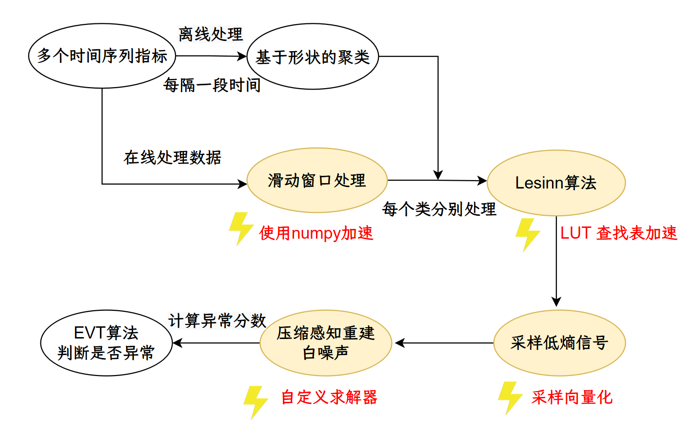

# NeuTracer:   基于 eBPF 实现的 AI 性能分析追踪器

# 一、基本信息

<h1>
  <!--  -->
  <!--  NeuTracer  -->
  
</h1>

<!-- NeuTracer 是一款基于 eBPF 技术的 AI/ML 性能分析与异常检测工具，致力于为机器学习和人工智能应用提供全方位的可观测性。该项目具备**低开销、高效率、零侵扰、全栈覆盖**等多项优势，同时通过高效精准的算法实现了数据采集与异常检测，包括 **GPU 内存泄漏检测算法、GPU 显存碎片化检测算法、压缩感知算法，动态模态分解算法，以及基于不变量的神经元异常检测算法**。

目前， AI/ML 可观测性存在挑战：一方面，AI/ML 工作负载往往训练周期长，跨越底层应用到上层驱动等一系列层面，而现有的工具往往只能对单一层面分析；另一方面，传统的 Nvidia nsight 工具开销大，难以部署到生产环境中。为了解决这些痛点与难点,  NeuTracer 应运而生。

**与 Nsight 等工具相比**，NeuTracer 在保证 **CUDA 事件收集率 100%** 的前提下，把**开销从大于25%降低到10%以内**。**对比其他 eBPF 工具**，NeuTracer 引入了 **blazesym** 等工具，能够**自动挂载并精准定位 CUDA API 及自动解析 CUDA 自定义函数**，无需用户进行麻烦的符号解析。**相较于 pytorch profiler 等 Python 分析工具**，NeuTracer 不仅可收集 **CPU 系统和 GPU 显卡等多维度数据**，还能综合分析，定位具体问题。

在异常检测方面，我们**基于拉普拉斯继承规则检测 GPU 内存泄漏**，**从空间、时间角度检测 GPU 显存碎片化**，可以高效定位异常，还引入 [**MDTP**](#444-cuda显存碎片化异常)，增强碎片化可视化效果，同时**延迟在 5s 以内**，**开销保持在5%以内**。同时，我们引入**压缩感知算法与动态模态分解**，速度快，效率高，可处理高维度数据，只需要单个CPU、同时内存开销保存在 **270M** 左右。我们的算法不需要预训练，适应多样负载，F1 分数稳定保持在 **80%** 左右。对于神经网络python层面的异常，我们接入了**Traincheck**框架，通过AI训练中的不变量，快速判断是否发生异常。同时，NeuTracer 集成了 **LLM 驱动的异常分析框架**，能基于上述丰富的数据生成详细的分析报告与优化建议，易于集成和使用。

NeuTracer 借鉴了 **Neutrino(OSDI 25)、Traincheck(OSDI 25)、JumpStarter(ATC 21)、VersaGuardian(IEEE TOM 25)** 等项目并进行创新。对 Neutrino，我们借鉴了项目中MDTP来可视化显存碎片化。对 Traincheck，我们基于CUDA API以及系统指标拓展了不变量的范围，在测试中 **额外检出5%\~10%** 违反的不变量关系。对 JumpStarter，我们在算法逻辑不变以及F1分数基本不变的情况下，优化了并行性以及求解器，提升**6.2倍**。 -->


NeuTracer是一款基于eBPF技术的AI/ML**性能分析与异常检测**工具，通过零侵扰的内核级监控实现从GPU到Python应用层的全栈覆盖。与 Nsight 等工具相比，在保证 CUDA 事件收集率不变的前提下，把开销从大于25%降低到10%以内。该项目创新性地实现了基于**拉普拉斯继承规则**的**GPU内存泄漏检测算法**和结合**空间与时间维度**的**显存碎片化检测算法**，并引入[**MDTP**](#444-cuda显存碎片化异常)(Meomory Distribution Timeline Plotter)，增强碎片化可视化效果，相较于Compute Sanitizer内存泄漏检测工具，将至少6倍的延迟降低到**5秒**以内的低延迟和低于 **5%** 的系统开销。同时集成了**压缩感知技术**进行时序异常检测，在F1分数基本不变的情况下，通过多方面的算法将压缩感知平均加速了 **6.2倍**。NeuTracer还接入了Traincheck框架用于神经网络静默异常检测，并基于 **CUDA API** 拓展了不变量的范围，在测试中额外检出 **5%到10%** 违反的不变量关系。项目还集成**LLM驱动的智能分析框架**生成详细的优化建议，为AI/ML应用提供了低开销、高精度的全方位性能监控和异常诊断。

我们还使用 vuepress 搭建了[NeuTracer 介绍手册](https://lightbreezz.github.io/NeuTracer_Tutorial/)。

## **五大核心特性**

- **🎯 高效的GPU性能分析**：通过 eBPF 技术对 CUDA 内核启动、同步事件和内存分配等 GPU 事件进行追踪和分析，实现零侵扰的 GPU 层面深度监控
- **📊 全面的性能监控**：覆盖从底层硬件到上层应用，提供全面的性能视图
- **⚡ 低开销的数据收集**：使用 eBPF 技术确保性能数据收集的开销最小化（[开销&lt;10%](#55--neutracer-性能测试)），同时不影响应用程序
- **🤖 自动化追踪和分析**：通过 gRPC 自动化收集多个主机和分析器的数据，支持分布式监控
- **🛠️ 易于集成和使用**：易于集成到现有 AI/ML 开发环境中，且对用户友好,使用方便，可视化直观，数据标签可读性强

---

<!-- ## **五大亮点**

- **🚀 低开销**：使用 eBPF 技术栈，将**性能开销控制在10%以内**，确保监控不影响 AI/ML 工作负载的正常运行
- **⚡ 高效率**：使用 grpc 进行高效的数据传输，使用压缩感知无需预训练，无需加载相关参数，减少系统内存压力
- **🔒 零侵扰**：基于 eBPF 内核级监控，对应用程序完全透明，eBPF程序在内核沙箱中运行，确保系统稳定性
- **📊 全栈覆盖**：**GPU侧**支持检测 CUDA 内核启动、内存分配/释放等，**CPU侧**支持检测进程调度、内存管理、I/O 操作、网络通信，**应用侧**面侧支持 Python 调用栈回溯，并且都具备实现相关**异常检测**的能力。
- **🎯接入多种分析框架**：接入 Strobelight 和 TrainCheck 做异常分析，后续会接入 Neutrino 等实现更深度的性能剖析。 -->

<!-- --- -->

# 二、项目使用指南

本节介绍NeuTracer的安装与使用方法。

## 相关工具安装

+ 安装 nlohmann-json

```shell
sudo apt-get install nlohmann-json3-dev
```

+ 安装 cargo

```shell
sudo apt-get install build-essential
```

+ 安装 fmt

```shell
sudo apt-get install libfmt-dev
```

## NeuTracer安装教程

1. 数据收集部分安装
```shell
git clone --recursive https://gitlab.eduxiji.net/T202518123995967/project2721707-303300.git
cd libbpf/src
make
cd ../..
cd blazesym
cargo build --release
cargo build --package=blazesym-c --release
cd ..
make all
```
2. python部分安装
```shell
pip install -r requirements.txt
```

## NeuTracer使用教程

### 数据收集端使用方式

1. 追踪已有进程
```shell
./neutracer -p <PID> [选项]
```

2. 启动并追踪新程序
```shell
./neutracer profile <程序路径> [程序参数] [选项]
```

#### 常用参数说明

| 参数 | 说明 | 示例 |
|------|------|------|
| -p | 指定目标进程PID | -p 12345 |
| -v | 输出详细调试信息 | -v |
| -d | 设置追踪时长（秒） | -d 30 |
| -r | 配置ring buffer最大条目数 | -r 1000 |
| -a | 采集CUDA内核参数 | -a |
| -s | 采集CUDA调用堆栈 | -s |
| -g | 启用gRPC实时数据流 | -g |
| -S | 指定gRPC服务地址 | -S localhost:8080 |
| -t | 选择追踪模块 | -t gpu/cpu/mem/net/io/.../all |

#### 使用示例

1. 对指定进程进行详细追踪：
```shell
./neutracer -p 12345 -v -d 30
```

2. 启动并监控训练脚本：
```shell
./neutracer profile python train.py -a -s
```

3. 实时数据流监控：
```shell
./neutracer profile ./my_app arg1 arg2 -g
```

#### 绘制火焰图

注：此功能在开启grpc和server端的情况下才可以使用

```shell
  cd analyzer/visualizer/convert_to_perfetto.py
  export PROTOCOL_BUFFERS_PYTHON_IMPLEMENTATION=python
  python convert_to_perfetto.py -o 输出文件名 日志文件路径
```

#### 绘制MDTP（Memory Distribution Timeline Plotter）

```shell
  cd analyzer/visualizer/draw_cuda_frag_plus.py
  python draw_cuda_frag_plus.py
```

#### 启动server端

```shell
  cd server
  python main.py
```

server端具体配置见[服务端介绍](doc/server.md)

#### Grafana与Prometheus使用教程

根据`analyzer/grafana_prometheus`下的配置文件启动grafana以及Prometheus

## 压缩感知使用
首先按照`analyzer/compressed-sensing/requirements.txt`，安装环境依赖，之后修改相关参数以使用。

```py
row_start = 0
col_start = 1
header = 1
#detect(input_file, output_file, row_start, col_start, header)
detect("./dataset/loss_spike.csv", "./result/loss.csv", row_start, col_start, header)
```


---

# 三、项目概述

## 3.1 背景


随着人工智能（AI）和机器学习（ML）技术的迅猛发展，AI模型的复杂度呈指数级增长。以大型语言模型（LLM）为例，训练单个超参数组合的成本可能高达数十万美元。但是在实际的AI/ML工作负载中，常常会出现各种问题。如上图所示，错误来源呈现出多样化和复杂化的特点。从错误位置分布来看，用户代码错误和框架相关错误各占32%，此外还有其他问题。从根本原因类型分析，边界情况处理不当占比25%，其次是超参数选择不当占22%，硬件/驱动问题占15%，并发问题占12%。这些数据清晰地表明，AI/ML系统的错误来源广泛，传统的单点监控方案已经无法满足现代AI/ML系统的可观测性需求。

传统的监控工具往往只能覆盖系统的某一层面，无法提供从GPU内核调用到Python应用层的完整视图。虽然传统的 Nvidia nsight 工具功能强大，但是开销大，无法支持在线分析，难以进行二次开发部署到生产环境中。因此，我们将目标投向 eBPF 与可观测性。eBPF程序开销小，功能强大，在内核沙箱中运行，确保系统稳定性。NeuTracer旨在通过eBPF技术的创新应用，构建一个较为全面的AI/ML性能分析和异常检测。

<!-- 具体的背景调研与相关工作参考如下文档：[详细背景调研](doc/1-project_intro/详细背景调研.md)、[相关工作介绍](doc/1-project_intro/相关工作介绍.md) -->

## 3.2 关于 NeuTracer


🌟 **全栈适配**

如上图所示，现代 AI/ML 系统呈现出复杂的分层架构特征，从底层GPU硬件到上层模型应用，每一层都有其独特的技术栈和性能特征。NeuTracer提供一致的监控体验和异常检测能力，初步包括底层的GPU内核函数，关键的网络以及通信协议，linux内核的重要数据，cuBLAS等函数库函数检测，以及pytorch的监控。

🚀 **技术创新**

eBPF 作为革命性的Linux内核技术，具备安全性、高效性、可编程性和低开销性等核心优势，传统的 eBPF 应用大多用于云原生观测、网络协议加速等，NeuTracer 将 eBPF 技术运用在现代 AI/ML 系统的监控中，能够在不影响工作负载性能的前提下，提供细粒度的全栈监控。

🌍 **开源绿色**

作为开源项目，NeuTracer秉承开放共享的理念，致力于为 eBPF 生态贡献力量。同时，通过精确的性能监控和分析，NeuTracer有助于提升AI/ML工作负载在整个技术栈上的运行效率，有利于降低计算成本，减少能源消耗，助力绿色计算以及可持续发展。

<!-- 项目更详细的介绍请参考：

[项目介绍](doc/1-project_intro/项目介绍.md) -->

## 3.3  NeuTracer 架构简述


<!--  -->

上图展示了 NeuTracer 项目的组成结构，主要包括：

- 基于C++实现的 NeuTracer 客户端模块，采样程序运行时有关的内核数据，并提供初步数据分析与处理等功能。
- 基于python实现的 NeuTracer 服务端模块，负责接收客户端传来的数据
- 异常检测与性能分析的模块，包括压缩感知、GPU异常诊断，Python异常诊断、火焰图绘制等。
- 可视化面板展示模块
- 基于LLM的日志分析模块，生成分析报告

## 核心组件说明

| 组件                      | 关键词                          | 技术栈                   |
| ------------------------- | ------------------------------- | ------------------------ |
| **NeuTracer客户端** | eBPF数据收集，系统监控          | C++, eBPF, libbpf        |
| **NeuTracer服务端** | 数据接收，处理，转发            | Python, gRPC, Prometheus |
| **异常检测模块**    | 神经网络异常，时序异常，GPU异常 | 不变量推断, 压缩感知算法等 |
| **可视化面板**      | 实时监控，图表展示              | Grafana, TensorBoard     |
| **AI辅助诊断**      | 日志分析，智能诊断              | Python, LLM              |

### 1. ①到⑤NeuTracer  客户端（C++）

- **内核态数据采集**：利用eBPF技术在Linux内核中部署字节码程序，通过系统调用追踪收集CPU、内存、IO、网络和函数调用等关键指标。针对AI/ML场景，重点监控CUDA相关函数（如cudaLaunch、cudaMalloc等）的GPU侧数据。
- **用户态数据处理**：客户端对采集的原始数据进行初步分析和处理，通过高性能gRPC框架以protobuf格式将结构化数据传输至服务端，确保数据传输的效率和可靠性。
- **系统 eBPF 模块分析**

  | 模块类别       | 挂载点类型       | 核心功能                   |
  | -------------- | ---------------- | -------------------------- |
  | I/O操作        | Tracepoint       | 磁盘读写延迟、吞吐量分析   |
  | CPU调度        | Tracepoint       | 进程调度、CPU利用率监控    |
  | 用户函数调用   | Uprobe/Uretprobe | 函数入口/退出跟踪          |
  | CPU内存管理    | Tracepoint       | 内存分配/释放、泄漏检测    |
  | 网络流量       | Tracepoint       | 网络发送/接收、协议解析    |
  | 系统调用       | Tracepoint       | 调用号、参数以及返回值    |
  | 总线       | Tracepoint       | DMA 数据传输、PCIe 配置    |
  | NVLink       | kprobe       | 跟踪 NVLink 操作    |
  | GPU事件        | Uprobe/Uretprobe | CUDA内核启动、内存操作     |
  | Python函数调用 | perf_event       | Python语言层面函数调用跟踪 |
- **GPU eBPF 模块分析**

  | 监控类型               | 函数挂载点                  | 捕获数据                   | 应用场景     | 技术特点             |
  | ---------------------- | --------------------------- | -------------------------- | ------------ | -------------------- |
  | **CUDA内核启动** | `handle_cuda_launch`      | 网格/块配置、参数、调用栈  | 内核性能分析 | 支持参数捕获和栈回溯 |
  | **内存分配**     | `cudaMalloc`/`cudaFree` | 分配大小、设备地址、时间戳 | 内存泄漏检测 | 异步操作跟踪         |
  | **内存传输**     | `cudaMemcpy`              | 传输方向、大小、带宽       | 数据传输优化 | 支持多种传输模式     |

具体细节参考[在线文档数据收集部分](https://lightbreezz.github.io/NeuTracer_Tutorial/guide/data.html)

### 2. ⑥NeuTracer  服务端（Python）

- 通过 gRPC 接收来自客户端的数据。转发给**异常监测与性能分析模块、可视化面板模块、基于LLM的日志分析模块**，以便进行后续的 Python函数层面、CUDA核函数调用层面、时间序列的异常检测。使得用户可以通过直观的方式查看系统性能等信息。利用日志中的信息辅助进行异常分析。

<div align="center">
    
  </div>

具体细节参考[在线文档服务端部分](https://lightbreezz.github.io/NeuTracer_Tutorial/guide/server.html)
### 3. ⑨⑩⑪异常检测与性能分析模块

#### ⑨压缩感知

- 使用压缩感知技术，对收集到的CPU、内存、网络、IO等信号进行重建，对数据进行异常诊断，例如，通过分析系统性能指标的波动情况，判断是否存在性能瓶颈或异常行为。
- 压缩感知基于如下思想，当原始时间序列不包含异常时，原始时间序列和重建的多变量时间序列（仅由低能量分量组成）之间的差异应该类似于白噪声。多变量时间序列中的异常，如抖动、突然下降，通常表现为包含高能分量的强信号，这与白噪声有很大不同。因此，我们可以通过检查滑动窗口中原始时间和重建的多元时间序列之间的差异是否与白噪声非常不同来判断时间序列是否包含异常。
- 考虑到AI/ML系统中不同监控指标间的关联性往往是未知且动态变化的，我们借鉴了论文《Jump-Starting Multivariate Time Series Anomaly Detection for Online Service Systems》中提出的基于形状聚类算法的思想，无需人工标注数据标签即可实现高精度的异常检测。



如图，这是压缩感知的流程，首先采集多个系统或应用的时间序列指标，作为原始数据输入。对数据进行离线处理，每隔一段时间，基于指标的形状进行聚类，将数据分为不同类别。在线处理数据时，采用滑动窗口机制，对每个类别的数据分别处理。对每个类别的数据应用 Lesinn 算法进行异常检测。该算法通过查找表（LUT）进一步加速。Lesinn算法输出采样后的低熵信号，并进行向量化采样。利用自定义求解器对采样信号进行压缩感知重建。最后通过 EVT（极值理论）算法计算异常分数，判断当前时间窗口是否存在异常。


对比其他时间序列异常检测方法，NeuTracer 在纵轴上处于较高位置，说明其异常检测能力和覆盖层级（从进程、函数到整体系统）都有优势。

NeuTracer 在横轴上处于较右位置，代表其监控和分析过程对被监控程序影响极小。传统工具如 OmniAnomaly 等往往存在较大的训练或运行开销，而 NeuTracer 通过 eBPF 技术实现了低侵扰、低资源消耗的实时监控。

与依赖大量训练数据的传统异常检测方法不同，NeuTracer 支持无监督、无预训练的异常检测，适应多样化的 AI/ML 负载，易于部署到生产环境。

具体细节参考[在线文档压缩感知部分](https://lightbreezz.github.io/NeuTracer_Tutorial/guide/detector/cs.html)
#### ⑩CUDA 异常检测

- GPU内存异常检测，通过eBPF实时监控CUDA API调用并收集相关数据，通过API调用的参数和返回值检测CUDA API异常和内存不足，采用基于**阈值采样**和**拉普拉斯继承规则**的算法检测**CUDA 内存泄漏**。


- 综合**时间、空间**等多角度多指标分析**显存碎片化**，提供智能诊断，并使用[**MDTP**](#444-cuda显存碎片化异常)(Memory Distribution Timeline Plotter)作为可视化方案。


<!-- 下图是我们检测出的CUDA内存分布，可以很清晰地看出是否有显存碎片化的现象。 -->

<!-- - 正常情况
    
  - 显存碎片化异常
     -->

具体细节参考[在线文档CUDA异常检测部分](https://lightbreezz.github.io/NeuTracer_Tutorial/guide/detect.html)

#### ⑪python侧部分

- 全栈分析，绘制 Python语言层面、CUDA内核启动函数层面、运行时库（**libcudart.so, libtorch.so**）层面 的火焰图，显示程序中各个函数的调用栈及其占用的 CPU 时间比例，帮助开发者快速定位性能问题的根源。

<!-- 这是python函数排序火焰图。
  
这是内核函数调用次数统计图。
   -->

- 使用栈回溯技术，通过 eBPF 技术，捕获高层次Python语言级别的数据。
  
- 接入TrainCheck框架，并使用 **CUDA API** 等系统指标拓展了不变量的范围，实现基于不变量的神经网络异常检测，有效定位如神经元异常等异常。
  

具体细节参考[在线文档神经网络常检测部分](https://lightbreezz.github.io/NeuTracer_Tutorial/guide/detector/traincheck.html)
### 4. ⑦ 可视化模块

- 通过直观的图表、仪表盘和告警界面，使用户能够快速理解系统性能状况，及时发现和处理潜在问题。
  
  为了提升NeuTracer可视化面板的用户体验和数据可读性，我们在Grafana监控面板中引入了智能的正则表达式处理机制，通过多层次的数据标签转换，将复杂的CUDA内核函数名称转换为简洁易懂的可视化标签。示例：
- **原始函数名**：`void at::native::(anonymous namespace)::elementwise_kernel<128, 4, __nv_hdl_wrapper_t<false, false, false...>`
- **简化显示**：`elementwise_kernel`
- **完整信息**：可展开查看完整的模板参数和命名空间信息
  处理原理：第一层匹配：`(.*?)<.* -` 提取函数核心名称，移除模板参数
  第二层匹配：`.*:(.*) -` 移除命名空间前缀，保留函数主体名称


这是GPU专项监控面板，重点展示CUDA内核函数调用次数、内存传输速率、GPU内存使用量等关键指标，特别适用于深度学习模型训练和推理过程的性能优化。

此面板聚焦于CPU性能和系统整体资源状况，展示CPU利用率、进程状态、NUMA节点使用情况，以及实时的CPU负载分布，帮助识别系统级性能瓶颈。此面板还可以展示IO延迟和IO吞吐。

此外，还有其他的面板，用于显示用户态函数调用情况以及函数运行时间、网络活动、磁盘读写情况等。

<!-- 
该面板显示了用户态函数调用情况以及函数运行时间，并可以看到活跃用户态函数相关信息。该面板还有磁盘设备读写情况以及内存使用情况。

该面板专门监控AI/ML应用网络活动，显示网络连接状态以及数据传输情况，为分布式训练提供详细的行为分析。该面板也能对应用层server端网络情况进行分析。 -->

### 5. ⑧ **基于LLM的日志分析模块**

- 基于人工智能技术对日志进行分析。日志是系统运行过程中的重要记录，包含了大量的系统状态信息、错误信息等。通过  AI 算法对日志进行分析，可以挖掘出潜在的异常模式。例如，利用自然语言处理技术对日志中的文本内容进行语义分析，识别出日志中的错误代码、警告信息等。然后，它可以将分析结果反馈给异常监测端，与其他数据源（如性能指标数据）相结合，更全面地进行异常监测，提高异常检测的准确性和效率。
  

具体细节参考[在线文档LLM增强部分](https://lightbreezz.github.io/NeuTracer_Tutorial/guide/detector/llm.html)

<!-- # 三、项目目标

## 初赛完成内容

### 数据收集与监控

- 使用  eBPF  技术实现 Python语言层面及 Pytorch 相关指标收集
  - 基于栈回溯的Python函数调用栈收集
  - Pytorch的API调用收集
- 使用  eBPF  技术实现 CUDA 相关指标收集
  - CUDA 内核启动事件追踪与分析
  - CUDA 内存事件（分配、释放、传输）追踪与分析
  - 其它 CUDA API 追踪
- 使用  eBPF  技术实现传统 OS 相关指标收集
  - 函数调用情况追踪
  - CPU 调度指标收集
  - IO 指标收集
  - CPU 内存分配指标收集
  - 网络指标收集

### 性能分析与异常检测

- 完成 CUDA 相关的性能分析与异常检测
  - CUDA API 调用异常检测
  - CUDA 内存不足异常检测
  - CUDA 内存泄漏异常检测
  - CUDA 显存碎片化异常检测
  - 绘制内存事件相关图
- 大模型推理/训练时异常的注入
  - 静默异常
  - 0/1翻转异常
  - 神经元参数异常
- AI agent 辅助诊断
- 模型卡死检测

### 可视化与通信

- 可视化面板搭建与多机通信
  - Grafana 面板搭建
  - gRPC 传输数据
  - Prometheus 收集与存储数据

## 决赛完成内容

**压缩感知方面：**

1. 压缩感知使用numpy加速，并优化求解问题的结构，平均加速6.2倍
2. 引入动态模态分解，便于处理周期问题，与压缩感知算法互补，将F1分数提高至0.8左右
3. 使用Osqp与Eigen的Cpp库，写了压缩感知的cpp版本

**GPU检测方面：**

1. 采用基于拉普拉斯继承规则的高效内存泄漏检测算法，通过阈值触发检测，有高可解释性。
2. 综合时间、空间等多角度碎片化指标，应用轻量级预测算法进行量化评估，并引入 cuda_memory_timeline_plot 直观呈现碎片化程度。

**Python异常检测方面：**

1. 将eBPF收集的CPU, GPU等数据与TrainCheck框架结合，新增了不变量关系，实现了更高的异常检出覆盖率。
2. 基于AST，实现了简单的静态分析，定位脆弱函数。
-->

<!-- ## 未来展望

- 深入追踪Python变量的创建、修改和销毁过程，实现变量级别的精细化监控，为内存优化和性能调优提供更详细的数据支撑
- 进一步与TrainCheck框架结合，基于不变量检测理论拓展神经网络异常检测算法，提升模型训练过程中的异常识别准确率和覆盖范围
- 增加对 AI/ML 更多的异常检测支持，重点关注分布式训练异常以及静默异常
- 实现CUDA、Python等不同层次监控数据的精确对齐，提升分析的精度以及准确率
- 对现有压缩感知异常检测聚类算法优化
- 支持对死锁、硬件中断等的追踪
- 基于收集的多维度监控数据，自动生成详细的性能分析报告，包括瓶颈识别、优化建议和趋势预测
- 使用高效率的数据库，实现海量监控数据的高效存储、快速查询和长期归档，实现智能数据压缩和存储优化策略，在保证数据完整性的前提下，降低存储成本和查询延迟 -->

<!-- ## 未来展望

为 eBPF 中文社区贡献出我们的一份力量 -->

## 3.4 项目优势

**NeuTracer** 的定位是“全栈 AI/ML 性能分析与异常检测”的新一代工具，我们使用主流的检测工具对比：

**PyTorch Profiler**（收集Python 层面调用的数据、函数Self CPU占用、函数Total CPU 占用等指标）

**Nsight System**（收集系统级的信息比如 CPU 层面、GPU层面、IO子系统、应用层事件、端到端时间线）

**Nsight Compute**（收集单个 CUDA Kernel 执行期间的细节）

**TrainCheck** (诊断Python语言层面的静默异常)

NeuTracer通过eBPF实现了全栈分析，在某些方面（如Python语言 Pytorch API调用等层面，达到了<10%的开销），具体测试结果见后文测试一节。

<!-- 对比**PyTorch Profiler，Nsight Compute，Nsight System**这三个项目,我们的优势如下： -->

| 异常类型               | 具体功能                 | **NeuTracer** | PyTorch Profiler | Nsight Compute | Nsight System | TrainCheck |
| ---------------------- | ------------------------ | ------------------- | ---------------- | -------------- | ------------- | ---------- |
| **GPU层**        | CUDA API异常             | ✅ 已支持           | ❌               | ✅ 支持        | ✅ 支持       | ❌         |
|                        | CUDA内存不足             | ✅ 已支持           | 🟡 间接支持      | ✅ 支持        | 🟡 间接支持   | ❌         |
|                        | **CUDA内存泄漏**   | ✅**已支持**  | ❌               | ❌             | ❌            | ❌         |
|                        | **显存碎片化**     | ✅**已支持**  | ❌               | ❌             | ❌            | ❌         |
|                        | GPU设备丢失              | ✅ 已支持           | ❌               | ❌             | ✅ 支持       | ❌         |
| **Python应用层** | 函数返回异常             | ✅ 已支持           | ✅ 支持          | ❌             | ❌            | ✅ 支持    |
|                        | PyTorch API异常          | ✅ 已支持           | ✅ 支持          | ❌             | 🟡 部分支持   | ✅ 支持    |
|                        | 函数调用耗时异常         | ✅ 支持         | ✅ 支持          | ❌             | ❌            | ✅ 支持    |
|                        | AttributeError           | ✅ 支持         | ✅ 支持          | ❌             | ❌            | ✅ 支持    |
|                        | RuntimeError             | ✅ 支持         | ✅ 支持          | ❌             | ❌            | ✅ 支持    |
|                        | AssertionError           | ✅ 支持         | ✅ 支持          | ❌             | ❌            | ✅ 支持    |
|                        | TypeError                | ✅ 支持         | ✅ 支持          | ❌             | ❌            | ✅ 支持    |
| **系统资源**     | CPU调度异常              | ✅ 已支持           | ❌               | ❌             | ✅ 支持       | ❌         |
|                        | 内存分配异常             | ✅ 已支持           | ❌               | ❌             | ✅ 支持       | ❌         |
|                        | 磁盘IO异常               | ✅ 已支持           | ❌               | ❌             | ✅ 支持       | ❌         |
|                        | 网络异常                 | ✅ 已支持           | ❌               | ❌             | ✅ 支持       | ❌         |
|                        | 时间序列异常             | ✅ 已支持           | ❌               | ❌             | ❌            | ❌         |
| **AI/ML专项**    | **静默异常**       | ✅ 已支持           | ❌               | ❌             | ❌            | ✅ 支持    |
|                        | **模型卡死检测**   | ✅ 已支持           | ❌               | ❌             | 🟡 间接支持   | ✅ 支持    |
|                        | **梯度异常检测**   | ✅ 已支持           | ❌               | ❌             | ❌            | ✅ 支持    |
|                        | **分布式训练异常** | 🟡 预计支持         | ❌               | ❌             | 🟡 间接支持   | ❌         |
| 其他                   | 火焰图生成               | ✅ 已支持           | ✅ 支持          | 🟡 部分支持    | ✅ 支持       | ❌         |
|                        | **全栈调用链追踪** | ✅**已支持**  | 🟡 部分支持      | ❌             | ✅ 支持       | ❌         |
|                        | 性能瓶颈定位             | ✅ 已支持           | ✅ 支持          | ✅ 支持        | ✅ 支持       | ❌         |
|                        | **零侵扰监控**     | ✅**已支持**  | ❌               | ❌             | ✅ 支持       | ❌         |
|                        | 实时性能监控             | ✅ 已支持           | 🟡 部分支持      | ❌             | ✅ 支持       | ❌         |
|                        | **AI辅助诊断**     | ✅**已支持**  | ❌               | ❌             | ❌            | ❌         |
|                        | **优化建议生成**   | ✅**已支持**  | ❌               | ❌             | ❌            | ❌         |
|                        | 可视化面板               | ✅ 已支持           | ✅ 支持          | ✅ 支持        | ✅ 支持       | ❌         |
|                        | **分布式监控**     | ✅**已支持**  | ❌               | ❌             | 🟡 部分支持   | ❌         |

---

# 四、测试结果

接下来介绍一下我们的测试结果
<!-- ，具体的环境配置和测试过程可见[测试文档](doc/5-test_files/测试.md)。 -->

## NeuTracer 项目测试环境指标

以下是测试环境的详细配置：

| **指标**  | **值**                     |
| :-------------- | :------------------------------- |
| Linux 发行版    | Ubuntu 20.04                     |
| Linux 内核版本  | 5.15.0                           |
| 机器模式        | 虚拟机                           |
| 内存大小        | 384G                             |
| 硬盘大小        | 500G                             |
| 处理器总核数    | 64                               |
| GPU             | NVIDIA A100 × 4（40GB 显存/卡） |
| Nvidia-smi 版本 | 560.35.05                        |
| CUDA 版本       | 12.6                             |
| 机器环境        | Native 环境                      |

本项目测试了和各主流大模型推理/训练框架的兼容性，具体如下（由于Llama.cpp不依赖Python，Python端没有生效）：

同时，由于时间、知识以及相关算力资源的因素，我们使用 Huggingface Transformers 微调进行测试。

| 训练/推理框架                  | GPU侧功能 | Python 端功能 | Linux OS层功能 |
| ------------------------------ | --------- | ------------- | -------------- |
| Llama.cpp(推理)                | ✅ 支持   | 🟡不支持      | ✅ 支持        |
| Huggingface Transformers(推理) | ✅ 支持   | ✅ 支持       | ✅ 支持        |
| vllm(推理)                     | ✅ 支持   | ✅ 支持       | ✅ 支持        |
| Huggingface Transformers(训练) | ✅ 支持   | ✅ 支持       | ✅ 支持        |

NeuTracer 旨在面向全栈场景，我们在以下核心维度（**三个功能、三个异常、一个开销**）进行了系统性功能和鲁棒性测试：

| **测试样例**             | **主要测试点**     | **通过情况** |
| :----------------------------- | :----------------------- | :----------------- |
| **Python 端功能测试**    | 调用栈采集、火焰图准确性 | PASS               |
| **GPU 侧功能测试**       | CUDA 事件收集完整性      | PASS               |
| **Linux OS 层功能测试**  | CPU、内存、GPU、IO收集   | PASS               |
| **GPU 侧异常检测测试**   | 内存及 CUDA API 相关异常 | PASS               |
| **神经网络异常检测**     | 模型卡死、静默异常检测   | PASS               |
| **压缩感知异常检测测试** | 信号重建、时序异常检测   | PASS               |
| **开销测试**             | 运行时监控性能开销       | PASS               |

## 4.1 Python 端功能测试

**此处对应全栈图的 LLM 训练/推理框架层（Pytorch）。**

本项目收集了Python训练程序(`python/test/cifar.py`)的调用栈数据，离线处理，可视化展示如下：

### 4.1.1 python函数图


该图展示了NeuTracer对Python CIFAR训练程序的函数级性能监控结果，成功识别出92个不同的函数调用，总计33543次函数执行。其中apply_pooling函数成为最大性能热点，占用7.29%的 Self CPU 时间和1501次调用；run_deep_learning_operations函数占用6.82% Self CPU 时间，执行1536次；而总模块占用97.28%的总CPU时间。测试结果证明了NeuTracer基于eBPF栈回溯技术的有效性。

### 4.1.2 python调用栈


该火焰图清晰展示了NeuTracer对PyTorch CIFAR训练程序的完整调用链追踪能力，成功捕获了从主线程到深层嵌套函数的所有执行路径。图中可以看到以main_thread为起点的完整调用栈，包含了pytorch_ext.py模块中的核心训练函数、数据处理函数以及各种环境配置函数的调用关系。火焰图的宽度表示函数执行时间占比，深颜色代表Self CPU 占用，浅颜色代表 Total CPU 占用，通过这种可视化方式，开发者可以直观识别出性能热点函数和调用瓶颈位置。

### 4.1.3 python火焰图


## 4.2 GPU 侧功能测试

**此处对应gpu层**

### 4.2.1 调用栈

我们收集了模型index-1.9b-chat推理时的CUDA内核启动事件的调用栈数据，离线处理,  绘制出的火焰图如下：


该火焰图清晰展示了NeuTracer对CUDA内核启动事件的完整调用链追踪能力，成功捕获了底层CUDA内核执行的调用路径。图中可以看到以主线程为起点的完整调用栈，包含了 `at::naive::vectorized`等PyTorch张量操作函数以及具体内核函数的嵌套调用关系。开发者可以直观识别出频繁调用的内核函数、PyTorch操作的性能热点以及CUDA内核启动的调用瓶颈，从而精确定位GPU计算密集型操作和优化目标。

### 4.2.2 事件统计

我们收集了模型index-1.9b-chat推理过程中的CUDA内核启动事件的数据，获取了内核启动事件的调用次数，并在grafana中实时显示调用次数较多的事件。通过实时监控CUDA内核启动事件的调用频次，能够即时识别GPU计算热点和性能瓶颈。


### 4.2.3 CUDA内存事件

#### CUDA内存分配

我们使用自己构建的神经网络测例(`test/pytorch_ex2.py`)并收集了其运行过程中多进程分配的CUDA内存数据，并可视化在grafana中，如图：


该图直观呈现了各进程内存分配的动态变化趋势，清晰展示了内存使用随时间的演化过程。

#### CUDA内存传输

同样的，我们也捕获了不同类型事件的实时的内存传输速率，并可视化在grafana中，如图：


通过监控多进程CUDA内存分配和内存传输速率，能够精确识别内存使用模式和数据传输瓶颈。

## 4.3 Linux OS 层功能测试

**此处对应Linux OS层**

NeuTracer 同样支持 OS 层及多机网络的性能与异常检测，覆盖 CPU/内存/IO/网络各类指标，首先每个指标结构体都包含时间戳 进程ID 线程ID、以及进程名称。

| 结构体                  | 字段说明                                                                                                                                                                                                                                                                                                                                                                |
| ----------------------- | ----------------------------------------------------------------------------------------------------------------------------------------------------------------------------------------------------------------------------------------------------------------------------------------------------------------------------------------------------------------------- |
| **CPUTraceItem**  | ppid：父进程ID <br>cpu_id：CPU编号 <br>oncpu_time：运行时间(微秒)<br>offcpu_time：等待时间(微秒)<br>utilization：CPU利用率(%)<br>migrations_count：CPU迁移次数 <br>numa_migrations：NUMA迁移次数 <br>hotspot_cpu：热点CPU <br>hotspot_percentage：热点占比                                                                              |
| **FuncTraceItem** | event_type：事件类型(ENTER/EXIT)<br>cookie：唯一标识 <br>call_count：调用次数 <br>avg_duration_us：平均持续时间(微秒)                                                                                                                                                                                                                                       |
| **IOTraceItem**   | operation：操作类型(读/写)<br>bytes：传输字节数 <br>latency_ms：操作延迟(毫秒)<br>device：设备名称 <br>major：主设备号 <br>minor：次设备号 <br>read_bytes：累计读取字节 <br>write_bytes：累计写入字节 <br>read_ops：读操作次数 <br>write_ops：写操作次数 <br>avg_read_latency：平均读延迟 <br>avg_write_latency：平均写延迟 |
| **MemTraceItem**  | operation：操作类型(alloc/free)<br>size：分配/释放大小(字节)<br>addr：内存地址 <br>stack_id：栈ID <br>total_allocs：总分配次数 <br>total_frees：总释放次数 <br>current_memory：当前内存使用量 <br>peak_memory：峰值内存使用量                                                                                                               |
| **NetTraceItem**  | is_send：发送或接收 <br>bytes：传输字节数 <br>src_addr：源IP地址 <br>dst_addr：目标IP地址 <br>src_port：源端口 <br>dst_port：目标端口 <br>protocol：协议 <br>tx_bytes：总发送字节数 <br>rx_bytes：总接收字节数 <br>tx_packets：总发送包数 <br>rx_packets：总接收包数 <br>active_connections：活跃连接数量                   |

对于系统调用、总线以及 NVLink 模块，我们并没有传输到服务端，仅保留在本机日志中。
| 结构体              | 字段说明                                                                                                                                                                                                                                                      |
|---------------------|---------------------------------------------------------------------------------------------------------------------------------------------------------------------------------------------------------------------------------------------------------------|
| **nvlink_event**    | type：事件类型<br>func_id：NVLink函数ID<br>dst_addr：目标地址<br>src_addr：源地址（memset时为值）<br>size：大小/长度<br>ret_val：返回值（strcpy/memcpy为目标指针，memset为目标指针） |
| **pcie_event**      | type：事件类型<br>op_type：PCIe操作类型<br>bus：总线号<br>devfn：设备功能号<br>offset：偏移量<br>size：访问大小<br>value：写入值或读取结果                                             |
| **dma_fence_event** | type：DMA Fence事件类型<br>context：Fence上下文<br>seqno：序列号<br>duration_ns：等待时长（仅wait_end事件有效）                  |
| **syscall_event**   | type：事件类型<br>syscall_id：系统调用号<br>call_id：调用唯一标识<br>args[6]：系统调用参数（enter时有效）<br>ret_val：返回值（exit时有效）|


<!-- 目前NeuTracer支持以下异常告警

| 模块分类           | 异常类型                   | 检测思路                         | 触发条件           | 实际应用场景     |
| ------------------ | -------------------------- | -------------------------------- | ------------------ | ---------------- |
| **网络模块** | **突发流量模式**     | 计算流量间隔方差，检测间歇性高峰 | 方差>0.5           | 突发流量         |
|                    | **大量网络连接**     | 统计活跃连接数                   | 连接数>100         | 微服务连接泄漏   |
|                    | **高发送速率**       | 计算字节/秒传输速率              | >100MB/s           | 模型参数传输瓶颈 |
|                    | **高接收速率**       | 计算接收字节/秒速率              | >10MB/s            | 数据加载缓慢     |
| **内存模块** | **高内存周转率**     | 频繁分配/释放检测                | 周转率>90%         | 频繁对象创建销毁 |
|                    | **异常大内存分配**   | 对比历史平均分配大小             | >平均值10倍且>1MB  | 模型参数突然膨胀 |
| **CPU模块**  | **跨NUMA节点迁移**   | 追踪CPU迁移和NUMA拓扑            | NUMA迁移且计算密集 | CPU亲和性问题    |
|                    | **突发CPU使用**      | 检测利用率尖峰模式               | >平均值2倍且>70%   | 任务调度问题     |
|                    | **CPU资源争用**      | 高低利用率频繁交替               | 10样本中4次切换    | 多进程资源竞争   |
|                    | **单核心热点**       | 统计各CPU核心使用分布            | 单核>90%总时间     | 瓶颈识别         |
|                    | **上下文切换异常**   | 计算切换频率                     | >50%采样点切换     | 进程调度效率问题 |
| **I/O模块**  | **IO延迟异常**       | 对比历史平均延迟                 | >平均值5倍         | 存储设备性能下降 |
|                    | **频繁小块IO**       | 统计小于4KB的IO比例              | >80%小块IO         | 随机读写效率     |
|                    | **跨设备频繁访问**   | 统计访问设备多样性               | >3个设备且>50次IO  | 存储架构         |
|                    | **读写高度不平衡**   | 计算读写操作比例                 | 单类型>95%         | 应用IO模式优化   |
| **函数追踪** | **慢函数调用**       | 设定阈值检测执行时间             | >设定阈值          | 热点函数识别     |
|                    | **函数调用频率异常** | 统计调用次数分布                 | 统计分析           | API滥用          | -->

## 4.4 GPU 相关异常检测

我们使用自己构造的一些会引发CUDA异常的测试样例完成了以下的测试

### 4.4.1 CUDA API调用异常

我们构造一个典型的会引发CUDA API调用异常的例子：在对Llama-8B模型进行微调训练的过程中，人为将batch_size参数设置为一个超出系统承载能力的极大值，导致显存溢出而使训练任务无法正常启动。


可见NeuTracer成功检测出了我们构造的分配大内存的CUDA API调用错误。

### 4.4.2 CUDA内存不足异常

类似的，我们构造了一个典型的内存不足例子：在对Llama-8B模型进行微调训练的过程中，人为将batch_size参数设置为较大值，在训练的过程中会导致显存溢出而使训练无法完整进行。


可见NeuTracer给出了内存不足的警告，并给出了最近一次CUDA内存分配失败的位置，并且还可以结合我们在[4.4.1节](#441-cuda-api调用异常)中检测到的错误综合分析。

### 4.4.3  CUDA内存泄漏异常

我们使用了两个经典的内存泄露例子([case1](test/pytorch_ex3.py),[case2](test/pytorch_ex4.py))进行检测。第一个例子通过不断创建大量张量并只释放极少部分，导致大部分张量持续占用显存，从而模拟出内存泄漏现象，可以观察到显存使用量不断增加且无法回收。第二个例子是一个较为隐蔽的内存泄漏案例，是PyTorch中因计算图累积导致的内存泄漏。代码在GPU上不断创建新张量并累加到一个持久变量上，每次操作都调用 `requires_grad_()`来构建计算图，这些计算图会随着循环持续累积在显存中无法释放，最终导致GPU显存使用量不断增长，形成内存泄漏。


可见NeuTracer会给出实时的内存泄漏警告，并在程序结束后给出详细的内存泄漏报告。

同时，NeuTracer会持续追踪进程状态，一旦发现带有内存分配记录的进程已终止却存在未释放内存的情况，会发出内存泄漏警告。

可见NeuTracer给出了进程异常终止导致的内存泄漏的警告，反映了没有cudaFree的内存总量与记录数量。

### 4.4.4 CUDA显存碎片化异常

我们构造了一个典型的显存碎片化例子（[case](test/pytorch_ex5.py)）。这个例子通过分配大量小块张量并有选择地释放部分块，主动在GPU显存中制造多个较大的“空洞”，从而模拟显存碎片化的典型场景。程序首先分配数万个小张量，随后随机释放一部分小块，再进一步创建几个较大的空洞，最终尝试分配一个大块张量以验证碎片化对大块分配的影响。


可见NeuTracer基于CUDA地址的分布给出了综合性的分析并给出了评分和相关碎片化指标等详细信息，同时给出了接下来几个时间步预测的碎片化分数，这有利于针对性优化显存碎片化异常。


上图即我们使用的可视化方案MDTP，从中可以看到，显存碎片化导致的极端现象非常明显。随着时间的推移，显存空间先是逐步被大量张量填满，整体内存利用率不断下降，之后释放了一些小块形成了许多小碎片，最后创建了几个较大的空洞，最终在系统尝试分配大块张量时出现了明显的OOM（Out Of Memory）异常。图中右侧的红色区域清楚地标记了分配失败的时间，内存空间中间的大片空白则代表着由于碎片化产生的“空洞”，这些空间虽然总量可观，却无法满足大块分配的需求，因此导致了分配失败。

### 4.4.5 GPU 异常案例研究

我们选取了[基于PyTorch论坛真实案例](https://discuss.pytorch.org/t/unable-to-allocate-cuda-memory-when-there-is-enough-of-cached-memory/33296)构造的碎片化导致训练失败的实验进行测试。该案例源于一个典型的GPU显存分配失败问题，其中系统显示有足够的缓存内存但仍无法完成分配操作。由于原始论坛帖子未提供具体的复现代码，我们在Llama-8B模型微调训练框架中重现了这一异常场景。我们成功复现了与原始论坛案例相似的OutOfMemory错误模式，如下图所示。


利用NeuTracer对该异常程序进行监测后得到 
从图中可以清晰地看出，在训练准备阶段就发生了OOM异常，在尝试了几次分配之后训练得以正常进行，然而在后续的训练过程需要分配更大的内存用于训练时发生了OOM异常，导致程序直接终止。可以发现此时存在一些内存空洞，导致无法分配连续的大块。

从图中可以清晰地观察到GPU显存的碎片化演进过程。在训练初始阶段（时间0-10），系统即出现多2次OOM异常，表现为图中红色标记的分配失败事件，此时内存块分布有碎片化的趋势。随着训练进程推进到中期阶段（时间10-60），虽然系统通过多次重试实现了部分内存分配的成功，但显存空间中仍存在大量间隙和空洞，这些碎片化区域在图中表现为蓝色内存块之间的白色空隙。当训练进入后期需要分配更大连续内存块用于梯度计算和参数更新时，由于无法找到足够大的连续空间，再次触发OOM异常并导致程序终止，这一过程在时间轴末端的红色区域得到清晰体现。


针对检测到的碎片化问题，我们实施了系统性的优化策略来验证修复效果。通过一系列措施通过改善内存分配的时空局部性和连续性，显著提高了GPU显存的利用效率，使原本因碎片化导致失败的大块内存分配得以成功执行，训练过程恢复正常运行状态。针对修复后的程序，我们再一次运行NeuTracer，得到的MDTP如下图所示。


经过系统性优化策略修复后，从图中可以明显观察到显存使用模式的根本性改善。修复后的MDTP展现出截然不同的"紧凑型分布"特征：内存块在空间上呈现更加连续和规整的排列模式，深蓝色区域表示的大块连续内存分配明显增多，而碎片化导致的空白间隙显著减少。整个训练过程（时间0-70）中未出现任何红色OOM标记，表明内存分配策略的优化有效解决了碎片化问题。特别值得注意的是，修复后的内存分配呈现出明显的分层结构，不同大小的内存块能够有序排列，避免了碎片化现象的产生，使得训练程序能够稳定运行至完成。

具体细节参考[在线文档GPU异常案例研究部分](https://lightbreezz.github.io/NeuTracer_Tutorial/test/#_4-4-5-gpu%E5%BC%82%E5%B8%B8%E6%A3%80%E6%B5%8B%E6%A1%88%E4%BE%8B%E7%A0%94%E7%A9%B6)

## 4.5 神经网络相关异常检测

**此处对应训练/推理框架(Pytorch)层**

### 4.5.1 模型卡死检测

我们将正在训练的神经网络手动卡死在一个阶段，此时可以发现我们的CUDA调用栈和python调用栈会停止输出，此时可查看终端的输出内容并据此判断模型具体卡死在了什么位置。


### 4.5.2 静默异常检测

我们使用Traincheck,检测MNIST分类任务神经网络训练过程中的不变量(`invariants.json`)，过程中输出如下：


最终检测得到违反了不变量，进而说明了该神经网络的训练过程产生了静默异常（通过检查违反的不变量关系在训练代码中的实际对应，可定位静默异常最初发生错误的代码位置）。

我们还以Pytorch论坛的一个[issue](https://discuss.pytorch.org/t/obtaining-abnormal-changes-in-loss-and-accuracy/84911)为例进行测试，该issue描述了在训练过程中loss和accuracy突然异常变化的问题。我们使用NeuTracer和原来未经扩展的Traincheck进行检测，推理出的不变量数从910增加到933，检测到违反的不变量数从510增加到533，额外检测出23个不变量。

<div align="center">
    
  </div>


<!--  -->

## 4.6 压缩感知模块

**此处对应Linux OS层的综合数据指标判断与分析**

### 4.6.1 异常检测效果测试

由于缺少跟AI/ML负载有关的数据集，我们采用了论文JumpStarter中给出的云原生数据集，该数据集来自大型互联网公司A的真实生产环境，每个数据集包括27个样本。


| 数据集ID | 异常比率 | 数据维度 | 长度  |
| -------- | -------- | -------- | ----- |
| dataset1 | 4.16%    | 38       | 23706 |
| dataset2 | 5.25%    | 19       | 7200  |
| dataset3 | 20.26%   | 19       | 7200  |


NeuTracer 结合了压缩感知方法与动态模态分解方法，根据周期特征灵活选择这两个方法，理想的F1分数表示的是两个方法中对数据集里面的每个样本取最高的F1分数。


### 4.6.2 压缩感知速度测试


我们的加速大概在5-7倍左右，平均加速比为6.2倍。


此外，项目还基于 Osqp 和 Eigen 的 C++ 库实现了压缩感知算法的高性能 C++ 版本。由于时间有限，加上压缩感知的数学问题形式比较复杂，我们为了保证算法正确性，简化了一些并行逻辑，因此加速比只有2.3倍。未来预计对 压缩感知C++版本 进行进一步优化。


## 4.7  NeuTracer 性能测试

在性能开销对比测试中，我们选择了六个具有代表性的AI/ML工作负载作为测试基准，涵盖了大语言模型推理、微调训练、CNN训练和FlashAttention等多种典型场景。

| 测试用例 | Nsight Systems | PyTorch Profiler | NeuTracer (GPU) | NeuTracer (OS) | NeuTracer (Python) |
|---------|---------------|------------------|----------------|---------------|-------------------|
| index-1.9b-chat(推理) | 1.59x | 2.37x | 1.04x | 1.02x | 1.01x |
| index-1.9b-chat(微调训练) | 1.57x | 3.64x | 1.04x | 1.03x | 1.04x |
| CNN(训练) | 1.05x | 2.61x | 1.01x | 1.02x | 1.01x |
| FlashAttention-v2(推理) | 1.03x | 1.17x | 1.00x | 1.00x | 1.02x |
| llama8B(推理) | 1.98x | 3.56x | 1.04x | 1.01x | 1.02x |
| llama8B(微调训练) | 1.57x | 4.00x | 1.01x | 1.03x | 1.00x |

测试结果显示，相比传统监控工具Nsight Systems（开销1.03x-1.98x）和PyTorch Profiler（开销1.17x-4.00x），NeuTracer的各个监控模块均表现出显著的性能优势。其中GPU监控模块的开销控制在1.00x-1.04x范围内，操作系统层监控模块为1.00x-1.03x，Python层监控模块为1.00x-1.04x，所有模块的性能开销都稳定保持在4%以内，充分验证了eBPF技术在AI/ML场景下的低侵扰特性。


以上测试的nsys是仅跟踪CUDA事件的时间开销，Pytorch Profiler一项，是人工对训练/推理过程添加插桩代码，使用Pytorch Profiler监测函数调用信息，测试得到的结果。


内存使用效率方面的测试进一步证实了NeuTracer的轻量化设计。在所有测试场景中，NeuTracer的最大内存占用稳定维持在500MB左右，相比被监控程序动辄数GB的内存使用量，监控系统本身的资源开销几乎可以忽略不计。这种极低的内存占用使得NeuTracer能够在资源受限的生产环境中长期稳定运行，而不会对AI/ML应用的正常执行造成任何影响。


与业界广泛使用的Compute Sanitizer工具相比，NeuTracer在两个典型测试用例中的开销仅为1.02-1.05倍，而Compute Sanitizer的开销高达6.2-17.1倍，这一巨大差距充分体现了NeuTracer内存泄漏检测算法的高效性。


## 4.8 补充测试

我们将NeuTracer收集的GPU相关数据与其他分析工具的分析结果进行对比。

### 4.8.1 内核启动事件统计

我们使用index模型的推理作为测试，与Nsight System对比，统计了调用次数前五的内核启动事件数量，结果如下：


可以看到我们的统计达到了100%的正确率。

### 4.8.2 内存传输事件

我们使用index模型的推理作为测试，与Nsight System对比，统计了H2D(主机到gpu)和D2H(gpu到主机)两个事件我们捕捉到的内存传输总量，结果如下：


可以看到我们的统计达到了99.9%的正确率。


### 4.8.3 内存使用事件

我们将 NeuTracer 收集到的结果和pytorch自带的 `cuda.memory_allocated`统计的内存分配对比，使用index推理模型测出来的内存使用趋势曲线与内存使用分布如下：


可见 NeuTracer 可以很好地反映模型推理过程中的内存变化与内存使用分布。图中NeuTracer 会比PyTorch记录的内存大一点，这是因为PyTorch还有缓存机制，会先缓存一部分CUDA内存避免重复调用 `cudaMalloc` 和 `cudaFree` 函数， NeuTracer 捕获的内存总量可以更好的反映当前gpu的使用情况。

<!--  -->

# 五、项目借鉴

| 项目名称                | 简要介绍                                   | 我们的工作                                                                                   |
|------------------------|--------------------------------------------|---------------------------------------------------------------------------------------------|   
| [TrainCheck  (OSDI 25)](https://github.com/OrderLab/TrainCheck)           | 基于不变量检测神经网络异常                  | 基于CUDA API以及系统指标拓展了不变量的范围 |                                                  |
| [Strobelight （Meta）](https://github.com/facebookincubator/strobelight)           | 使用eBPF收集GPU事件                        | 借鉴了GPU内核符号解析逻辑                                                                   |
| [JumpStarter (ATC 21)](https://github.com/NetManAIOps/JumpStarter/)   | 使用压缩感知进行时序异常检测                | 在算法逻辑不变的情况下，优化了并行性以及求解器，提升6.2倍                                   |
| [VersaGuardian (IEEE TON 25)](https://github.com/AIOps-Lab-NKU/VersaGuardian)| 使用动态模态分解进行时序异常检测           | 借鉴了代码逻辑，衔接到我们的异常检测中，高效检测周期序列                                    |


# 六、演示视频

https://github.com/user-attachments/assets/579c3975-60b6-4382-b175-8ca125fb51ab


# 七、完整目录索引

项目文件结构详细说明

```
 neu-trace/                    # 项目根目录
├── 📁 analyzer/               # 数据分析与异常检测模块
│   ├── compressed-sensing/    # 压缩感知异常检测算法实现
│   └── visualizer/            # 数据可视化与图表生成
│   └── cpp-compressed-sensing/# 压缩感知C++版本实现
│   └── data-compress/         # 数据压缩实现
│   └── grafana_prometheus/    # 相关配置
│   └── llm-cli-tool/          # LLM 辅助诊断
│   └── python-ast/            # python AST解析
├── 📁 blazesym/               # 符号解析库（Rust实现）
├── 📁 bpftool/                # eBPF工具集
├── 📁 config/                 # 配置文件目录
├── 📁 doc/                    # 项目文档目录
├── 📁 include/                # C/C++头文件目录
│   ├── client/                # 客户端头文件
│   ├── bpf_config/            # bpf 端头文件
│   ├── detector/              # GPU 检测头文件
│   ├── snoop/                 # 监控模块头文件
│   └── utils/                 # 工具类头文件
├── 📁 libbpf/                 # libbpf库源码
├── 📁 perfetto/               # Perfetto库源码
├── 📁 protos/                 # gRPC协议定义文件
├── 📁 python/                 # Python相关模块
│   ├── eBPF/                  # Python eBPF追踪模块
│   ├── pytorchfi/             # PyTorch故障注入工具
│   ├── scripts/               # 辅助脚本集合
│   └── test/                  # Python测试用例
├── 📁 server/                 # 服务端实现（Python）
├── 📁 src/                    # C/C++源码目录
│   ├── bpf/                   # eBPF追踪模块
│   ├── client/                # 客户端
│   ├── neutracer.cpp          # 程序入口
│   ├── snoop/                 # 监控模块
│   ├── detector/              # GPU 检测文件
│   └── utils/                 # 工具函数
├── 📁 test/                   # 测试文件与用例
├── 📁 tools/                  # 辅助工具集
├── 📁 traincheck/             # TrainCheck静默错误检测框架
├── 📁 vmlinux.h/              # Linux内核头文件
├── CMakeLists.txt             # CMake构建配置
├── Makefile                   # Make构建脚本
├── README.md                  # 项目说明文档（当前文件）
└── LICENSE                    # 开源许可证
```

*🎉 感谢使用NeuTracer！如有问题请参考相应文档或提交Issue。*
