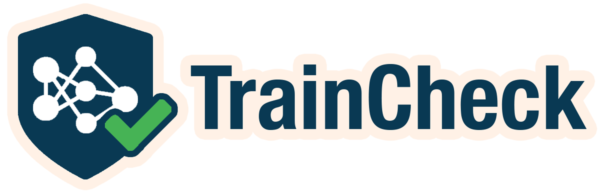
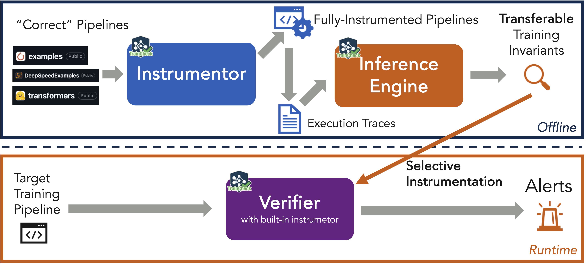

<div align="center">
<picture>
  
</picture>
<h1>TrainCheck: Training with Confidence</h1>

[](https://github.com/OrderLab/traincheck/actions/workflows/pre-commit-checks.yml)
[](https://discord.gg/ZvYewjsQ9D)

</div>


**TrainCheck** is a lightweight tool for proactively catching **silent errors** in deep learning training runs. It detects correctness issues, such as code bugs and faulty hardware, early and pinpoints their root cause.

TrainCheck has detected silent errors in a wide range of real-world training scenarios, from large-scale LLM pretraining (such as BLOOM-176B) to small-scale tutorial runs by deep learning beginners.

📌 For a list of successful cases, see: TODO

## What It Does

TrainCheck uses **training invariants**, which are semantic rules that describe expected behavior during training, to detect bugs as they happen. These invariants can be extracted from any correct run, including those produced by official examples and tutorials. There is no need to curate inputs or write manual assertions.

TrainCheck performs three core functions:

1. **Instruments your training code**  
   Inserts lightweight tracing into existing scripts (such as [pytorch/examples](https://github.com/pytorch/examples) or [transformers](https://github.com/huggingface/transformers/tree/main/examples)) with minimal code changes.

2. **Learns invariants from correct runs**  
   Discovers expected relationships across APIs, tensors, and training steps to build a model of normal behavior.

3. **Checks new or modified runs**  
   Validates behavior against the learned invariants and flags silent errors, such as missing gradient clipping, weight desynchronization, or broken mixed precision, right when they occur.

This picture illustrates the TrainCheck workflow:



Under the hood, TrainCheck decomposes into three CLI tools:
- **Instrumentor** (`traincheck-collect`)
  Wraps target training programs with lightweight tracing logic. It produces an instrumented version of the target program that logs API calls and model states without altering training semantics.
- **Inference Engine** (`traincheck-infer`)
  Consumes one or more trace logs from successful runs to infer training invariants.
- **Checker** (`traincheck-check`)
  Runs alongside or after new training jobs to verify that each recorded event satisfies the inferred invariants.

## 🔥 Try TrainCheck

Work through [5‑Minute Experience with TrainCheck](./docs/5-min-tutorial.md). You’ll learn how to:
   - Instrument a training script and collect a trace  
   - Automatically infer invariants  
   - Uncover silent bugs in the training script

## Documentation

- **[Installation Guide](./docs/installation-guide.md)**
- **[Usage Guide: Scenarios and Limitations](./docs/usage-guide.md)**
- **[TrainCheck Technical Doc](./docs/technical-doc.md)**
- **[TrainCheck Dev RoadMap](./ROADMAP.md)**

## Status

TrainCheck is under active development. Please join our 💬 [Discord server](https://discord.gg/VwxpJDvB) or file a GitHub issue for support. 
We welcome feedback and contributions from early adopters.

## Contributing

We welcome and value any contributions and collaborations. Please check out [Contributing to TrainCheck](./CONTRIBUTING.md) for how to get involved.

## License

TrainCheck is licensed under the [Apache License 2.0](./LICENSE).

## Citation

If TrainCheck is relevant to your work, please cite our paper:
```bib
@inproceedings{TrainCheckOSDI2025,
  author = {Jiang, Yuxuan and Zhou, Ziming and Xu, Boyu and Liu, Beijie and Xu, Runhui and Huang, Peng},
  title = {Training with Confidence: Catching Silent Errors in Deep Learning Training with Automated Proactive Checks},
  booktitle = {Proceedings of the 19th USENIX Symposium on Operating Systems Design and Implementation},
  series = {OSDI '25},
  month = {July},
  year = {2025},
  address = {Boston, MA, USA},
  publisher = {USENIX Association},
}
```


## Artifact Evaluation

🕵️‍♀️ OSDI AE members, please see [TrainCheck AE Guide](./docs/ae.md).