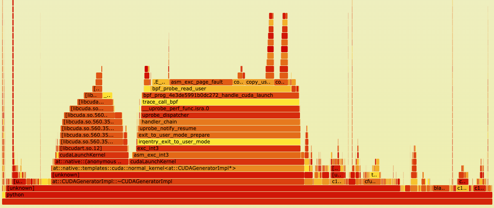
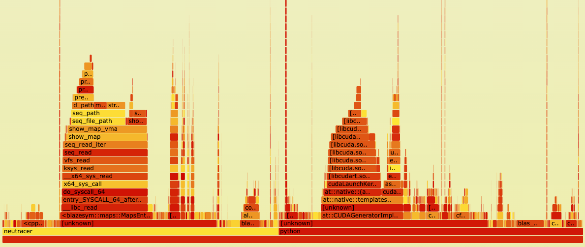

# 讨论与未来展望
## GPU侧数据收集性能开销分析

虽然NeuTracer在GPU侧数据收集方面性能开销已经很低了，但是仍然具有优化空间。我们利用perf工具对NeuTracer进行性能分析，发现GPU侧数据收集的性能开销主要来自于blazesym库的调用。

不使用blazesym的火焰图

使用blazesym的火焰图

对比中可以看出，如果去掉blazesym库的调用，GPU侧数据收集的性能开销非常低，相比于监测的python程序来说可以忽略不计。如果使用blazesym库，可以看到性能开销主要集中在blazesym库的调用上，其他有开销的地方主要是日志文件的写入。

blazesym是一个专门用于符号解析的高性能库，主要用于将内存地址转换为对应的函数名和源代码位置。主体代码由rust编写，并且带有C++的接口。优化该库的难度较高，因为时间有限未能尝试，后续可以考虑对该库进行优化。

## GPU碎片化检测的未来展望

随着大语言模型规模的快速扩展，GPU内存压力显著增加，内存碎片化问题变得更加复杂。在这种背景下，GPU碎片化检测技术的发展面临新的机遇与挑战。

在碎片化理论方面，GPU内存碎片化的特征刻画将进一步深化。借鉴Linux物理内存碎片化研究的方法论，未来研究可以更加关注生产环境中GPU内存使用模式的量化分析。通过大规模数据收集和统计分析，识别GPU内存碎片化的关键影响因素，建立更加准确的碎片化评估模型。特别是针对大模型训练中的虚拟流水线、重计算等优化技术如何破坏张量生命周期并引入内存碎片的深入研究，将为碎片化检测算法的改进提供理论基础。同时，构造合适的GPU显存碎片化例子也是个难题，未来研究可以在这方面进行探索。

在碎片化预测与内存整理方面，由于GPU不存在类似Linux上`compact_zone`等碎片化整理API，像eBPF和LightGBM结合的内存碎片化预测与内存整理方案无法迁移到GPU上。未来研究可以在本项目基础上使用MGPUSim等GPU模拟器上研究GPU上的显存碎片化预测和内存整理。或者使用时空规划的内存分配策略实现内存整理，如STWeaver。可以采用离线规划与在线分配相结合的内存管理范式。通过深度分析训练工作负载中内存分配行为的时空规律性，生成近优的分配计划，同时保持对动态模型（如专家混合模型MoE）的灵活适应能力。

在应用场景拓展方面，GPU碎片化检测技术将从单机扩展到分布式大模型训练环境。随着千亿、万亿参数模型的出现，多节点、多GPU的分布式训练成为常态，跨节点的内存碎片化协调优化将成为新的研究热点。
现有研究显示，GPU碎片化检测与优化在分布式环境下正成为业界关注的前沿方向。随着大型科技公司部署数千甚至上万张GPU以支持多样化的机器学习任务，GPU资源的共享和调度问题日益突出。实际生产环境中，部分GPU分配导致的碎片化现象十分严重，造成大量GPU无法被有效利用，极大地影响了整体算力的分配效率。未来研究可以聚焦于多节点、多任务上的GPU碎片化检测与调度优化。

## 其他未来展望
 
压缩感知模块在 Python 层面的优化已取得良好效果，未来将进一步从算法层面提升准确性和鲁棒性。项目已基于 OSQP 和 Eigen 库开发了高性能的 C++ 版本，但由于时间有限且压缩感知问题较为复杂，为保证算法正确性，部分并行逻辑进行了简化，目前加速比为 2.3 倍。后续将继续优化 C++ 版本，提升整体性能。

此外，受限于 AI/ML 相关时序指标数据集的缺乏，目前主要采用云服务数据集进行验证。未来将重点关注收集和利用更多 AI/ML 时序指标数据集，以更全面地评估压缩感知算法的准确性和鲁棒性。

项目还具备进一步拓展的潜力，可开发针对 AI/ML 应用入侵检测的工具。通过监控系统调用，可及时发现数据泄露、模型窃取等恶意行为；结合时序指标分析，还能有效检测模型崩溃、性能下降等异常现象，为 AI/ML 应用安全和稳定运行提供有力保障。
