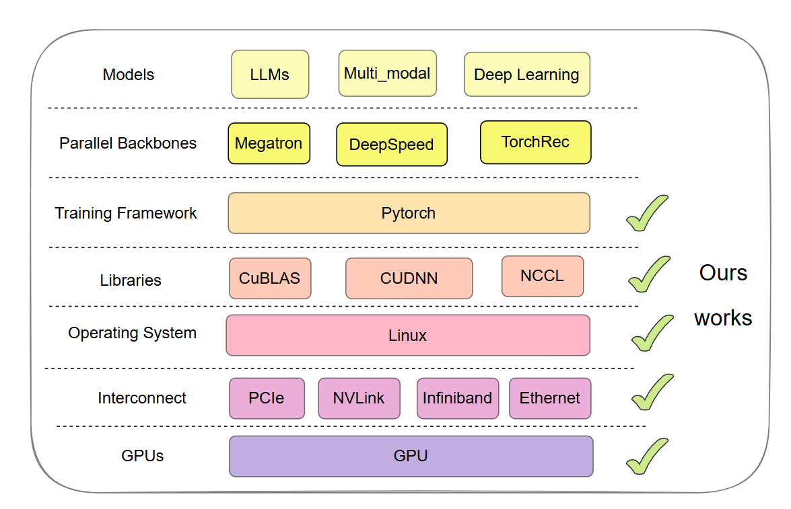
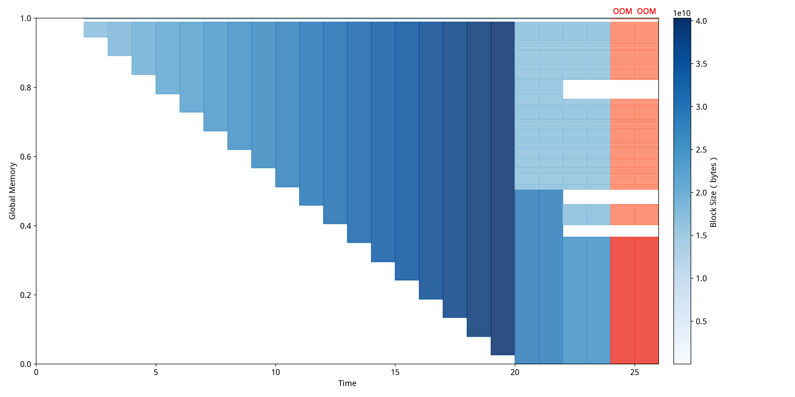

# 项目架构

🌟 **全栈适配**

如上图所示，现代AI/ML系统呈现出复杂的分层架构特征，从底层GPU硬件到上层模型应用，每一层都有其独特的技术栈和性能特征。NeuTracer项目的核心价值正体现在对这一完整技术栈全面支持上。NeuTracer提供一致的监控体验和异常检测能力，预计包括底层的GPU内核函数，关键的网络以及通信协议，linux内核的重要数据支持，cuBLAS等函数库函数检测，以及pytorch的监控。

🚀 **技术创新**

NeuTracer基于eBPF技术的创新应用，为AI/ML系统的可观测性领域提供灵感。从图中可以看出，eBPF作为革命性的Linux内核技术，具备安全性、高效性、可编程性和低开销性等核心优势，这使得NeuTracer能够在不影响AI/ML工作负载性能的前提下，提供细粒度的全栈监控。

🌍 **开源绿色**

作为开源项目，NeuTracer秉承开放共享的理念，致力于为AI/ML生态系统的发展贡献力量。同时，通过精确的性能监控和分析，NeuTracer能够显著提升AI/ML工作负载在整个技术栈上的运行效率，有利于计算成本的大幅降低、能源消耗的有效控制和碳排放的显著减少。在当前全球都在追求绿色计算和可持续发展的大背景下，这种技术创新具有一定的环保价值和社会意义。

上图展示了 NeuTracer 项目的组成结构，主要包括：

- 基于C++实现的 NeuTracer 客户端，采样程序运行时有关的内核数据，并提供初步数据分析与处理等功能。
- 基于python实现的 NeuTracer 服务端，负责接收客户端传来的数据
- 提供异常检测与性能分析的功能，包括异常诊断，火焰图绘制等。
- 可视化面板展示
- 使用LLM进行日志分析，生成分析报告

## 核心组件说明

| 组件                      | 功能描述               | 技术栈                   |
| ------------------------- | ---------------------- | ------------------------ |
| **NeuTracer客户端** | eBPF数据收集，系统监控 | C++, eBPF, libbpf        |
| **NeuTracer服务端** | 数据接收，处理，转发   | Python, gRPC, Prometheus |
| **异常检测模块**    | 压缩感知，异常诊断     | Python, 数学算法         |
| **可视化面板**      | 实时监控，图表展示     | Grafana, TensorBoard     |
| **AI辅助诊断**      | 日志分析，智能诊断     | Python, LLM              |
| **TrainCheck**      | 静默错误检测框架       | Python, 不变量推断       |

### 1. ①到⑤NeuTracer  客户端（C++）

- **内核态数据采集**：利用eBPF技术在Linux内核中部署字节码程序，通过系统调用追踪收集CPU、内存、IO、网络和函数调用等关键指标。特别针对AI/ML场景，重点监控CUDA相关函数（如cudaLaunch、cudaMalloc等）的GPU侧数据。
- **用户态数据处理**：客户端对采集的原始数据进行初步分析和处理，通过高性能gRPC框架以protobuf格式将结构化数据传输至服务端，确保数据传输的效率和可靠性。
- **系统 eBPF 模块分析**

    | 模块类别       | 挂载点类型       | 核心功能                   |
    | -------------- | ---------------- | -------------------------- |
    | I/O操作        | Tracepoint       | 磁盘读写延迟、吞吐量分析   |
    | CPU调度        | Tracepoint       | 进程调度、CPU利用率监控    |
    | 用户函数调用   | Uprobe/Uretprobe | 函数入口/退出跟踪          |
    | CPU内存管理    | Tracepoint       | 内存分配/释放、泄漏检测    |
    | 网络流量       | Tracepoint       | 网络发送/接收、协议解析    |
    | GPU事件        | Uprobe/Uretprobe | CUDA内核启动、内存操作     |
    | Python函数调用 | perf_event       | Python语言层面函数调用跟踪 |

- **GPU eBPF 模块分析**

    | 监控类型               | 函数挂载点                  | 捕获数据                   | 应用场景     | 技术特点             |
    | ---------------------- | --------------------------- | -------------------------- | ------------ | -------------------- |
    | **CUDA内核启动** | `handle_cuda_launch`      | 网格/块配置、参数、调用栈  | 内核性能分析 | 支持参数捕获和栈回溯 |
    | **内存分配**     | `cudaMalloc`/`cudaFree` | 分配大小、设备地址、时间戳 | 内存泄漏检测 | 异步操作跟踪         |
    | **内存传输**     | `cudaMemcpy`              | 传输方向、大小、带宽       | 数据传输优化 | 支持多种传输模式     |

### 2. ⑥NeuTracer  服务端（Python）

- 通过 gRPC 接收来自客户端的数据。转发给**异常监测与性能分析模块、可视化面板模块、基于LLM的日志分析模块**，以便进行后续的 Python函数层面、CUDA核函数调用层面、运行时库层面（libcudart.so）的异常检测。使得用户可以通过直观的方式查看系统性能等信息。利用日志中的信息辅助进行异常分析。

### 3. ⑨⑩⑪异常检测与性能分析模块

#### ⑨压缩感知

- 使用压缩感知技术，对收集到的CPU、内存、网络、IO等信号进行重建，对数据进行异常诊断，例如，通过分析系统性能指标的波动情况，判断是否存在性能瓶颈或异常行为。
- 压缩感知基于如下思想，当原始时间序列不包含异常时，原始时间序列和重建的多变量时间序列（仅由低能量分量组成）之间的差异应该类似于白噪声。多变量时间序列中的异常，如抖动、突然下降，通常表现为包含高能分量的强信号，这与白噪声有很大不同。因此，我们可以通过检查滑动窗口中原始时间和重建的多元时间序列之间的差异是否与白噪声非常不同来判断时间序列是否包含异常。
- 考虑到AI/ML系统中不同监控指标间的关联性往往是未知且动态变化的，我们借鉴了论文《Jump-Starting Multivariate Time Series Anomaly Detection for Online Service Systems》中提出的基于形状聚类算法的思想，无需人工标注数据标签即可实现高精度的异常检测。

如图，这是压缩感知的流程，首先采集多个系统或应用的时间序列指标，作为原始数据输入。对数据进行离线处理，每隔一段时间，基于指标的形状进行聚类，将数据分为不同类别。在线处理数据时，采用滑动窗口机制，对每个类别的数据分别处理。对每个类别的数据应用 Lesinn 算法进行异常检测。该算法通过查找表（LUT）进一步加速。Lesinn算法输出采样后的低熵信号，并进行向量化采样。利用自定义求解器对采样信号进行压缩感知重建。最后通过 EVT（极值理论）算法计算异常分数，判断当前时间窗口是否存在异常。

<!-- 

对比其他时间序列异常检测方法，NeuTracer 在纵轴上处于较高位置，说明其异常检测能力和覆盖层级（从进程、函数到整体系统）都有优势。

NeuTracer 在横轴上处于较右位置，代表其监控和分析过程对被监控程序影响极小。传统工具如 Nsight、OmniAnomaly 等往往存在较大的训练或运行开销，而 NeuTracer 通过 eBPF 技术实现了低侵扰、低资源消耗的实时监控。

NeuTracer 不仅支持底层硬件（GPU、CPU、IO、网络等），还覆盖到函数级、进程级和整体系统级，支持分布式场景。结合 LLM 智能分析和可视化，能够自动生成优化建议和异常报告，提升诊断效率。 -->

与依赖大量训练数据的传统异常检测方法不同，NeuTracer 支持无监督、无预训练的异常检测，适应多样化的 AI/ML 负载，易于部署到生产环境。

#### ⑩CUDA 异常检测

- GPU内存异常检测，通过eBPF实时监控CUDA API调用并收集相关数据，通过API调用的参数和返回值检测CUDA API异常和内存不足，采用基于**阈值采样**和**拉普拉斯继承规则**的算法检测**CUDA 内存泄漏**。

- 综合**时间、空间**等多角度多指标分析**显存碎片化**，提供智能诊断，并使用[**MDTP**](#444-cuda显存碎片化异常)(Memory Distribution Timeline Plotter)作为可视化方案。

#### ⑪python侧部分

- 全栈分析，绘制 Python语言层面、CUDA内核启动函数层面、运行时库（**libcudart.so, libtorch.so**）层面 的火焰图，显示程序中各个函数的调用栈及其占用的 CPU 时间比例，帮助开发者快速定位性能问题的根源。

- 使用栈回溯技术，通过 eBPF 技术，捕获高层次Python语言级别的数据。
  
- 接入TrainCheck框架，实现基于不变量的神经网络异常检测，有效定位如神经元异常等异常。
  

### 4. ⑦ 可视化模块

- 通过直观的图表、仪表盘和告警界面，使用户能够快速理解系统性能状况，及时发现和处理潜在问题。
  
  为了提升NeuTracer可视化面板的用户体验和数据可读性，我们在Grafana监控面板中引入了智能的正则表达式处理机制，通过多层次的数据标签转换，将复杂的CUDA内核函数名称转换为简洁易懂的可视化标签。示例：
- **原始函数名**：`void at::native::(anonymous namespace)::elementwise_kernel<128, 4, __nv_hdl_wrapper_t<false, false, false...>`
- **简化显示**：`elementwise_kernel`
- **完整信息**：可展开查看完整的模板参数和命名空间信息
  处理原理：第一层匹配：`(.*?)<.* -` 提取函数核心名称，移除模板参数
  第二层匹配：`.*:(.*) -` 移除命名空间前缀，保留函数主体名称

这是GPU专项监控面板，重点展示CUDA内核函数调用次数、内存传输速率、GPU内存使用量等关键指标，特别适用于深度学习模型训练和推理过程的性能优化。

此面板聚焦于CPU性能和系统整体资源状况，展示CPU利用率、进程状态、NUMA节点使用情况，以及实时的CPU负载分布，帮助识别系统级性能瓶颈。此面板还可以展示IO延迟和IO吞吐。

此外，还有其他的面板，用于显示用户态函数调用情况以及函数运行时间、网络活动、磁盘读写情况等。

### 5. ⑧ **基于LLM的日志分析模块**

- 基于人工智能技术对日志进行分析。日志是系统运行过程中的重要记录，包含了大量的系统状态信息、错误信息等。通过  AI 算法对日志进行分析，可以挖掘出潜在的异常模式。例如，利用自然语言处理技术对日志中的文本内容进行语义分析，识别出日志中的错误代码、警告信息等。然后，它可以将分析结果反馈给异常监测端，与其他数据源（如性能指标数据）相结合，更全面地进行异常监测，提高异常检测的准确性和效率。
  