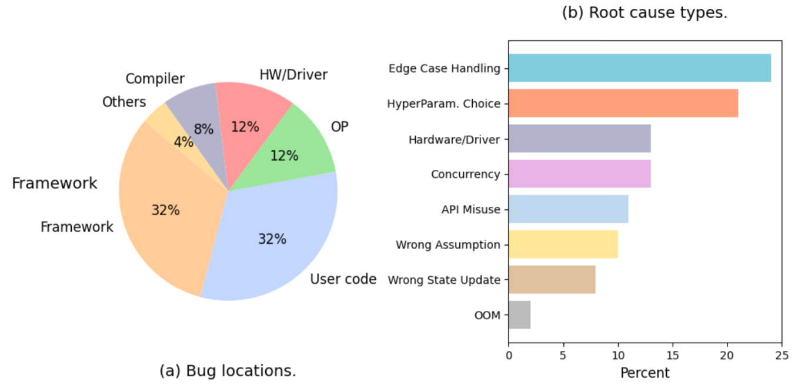

# 背景介绍
随着人工智能（AI）和机器学习（ML）技术的迅猛发展，AI模型的复杂度呈指数级增长。过去15年间，大型语言模型训练所用的**数据量年均增长高达260%**，而模型训练的**计算量更是以每年360%的速度飙涨**。同时，**新的AI模型发布数量呈现指数级攀升，年增幅达167%**, (来源：[AI report](https://www.statworx.com/en/content-hub/whitepaper/ai-trends-report-2025))。这种前所未有的发展速度，虽然带来了AI能力的巨大飞跃，但也催生了一系列严峻的挑战。

**高昂的训练成本与潜在风险**是当前AI/ML发展面临的主要瓶颈。以大型语言模型为例，即使像DeepSeek这样通过优化降低了训练成本的案例，其费用依然高昂。这类模型需要**数千万美元的投入**，动用**数千张GPU卡**，训练周期长达**数月之久**。如果在训练过程中出现任何问题，例如**模型收敛失败、硬件故障或数据质量问题**，不仅会导致**数百万甚至数千万美元的直接经济损失**，还会浪费大量宝贵的时间和计算资源。

当前AI/ML工作负载的**可观测性痛点**也日益突出。复杂的AI/ML系统涉及**计算、存储、网络多层交互**，且普遍存在**硬件异构化**的特点，如GPU、TPU、FPGA的混合部署，这使得性能监控变得异常复杂。传统的GPU监控工具，例如NVIDIA Nsight系列，虽然功能强大，但在**生产环境中使用会带来巨大的开销**，严重影响模型运行性能。此外，为了监控和调试，开发者往往需要对模型代码进行**侵入性修改**（插桩），这不仅可能影响模型的实际性能，而且在多语言（如Python、C++、CUDA）环境下，插桩的复杂度呈指数级增长，极大地增加了开发和维护的难度。

在实际的AI/ML工作负载中，错误来源呈现出多样化和复杂化的特点。从错误位置分布来看，用户代码错误和框架相关错误各占32%，成为最主要的两大错误源；硬件/驱动问题和算子问题各占12%；编译器问题占8%，其他问题占4%。从根本原因类型分析，边界情况处理不当成为最突出的问题，占比达到25%，其次是超参数选择不当占22%，硬件/驱动问题占15%，并发问题占12%。这些数据清晰地表明，AI/ML系统的错误不仅来源广泛，而且涉及从底层硬件到上层应用的全技术栈，传统的单点监控方案已经无法满足现代AI/ML系统的可观测性需求。

