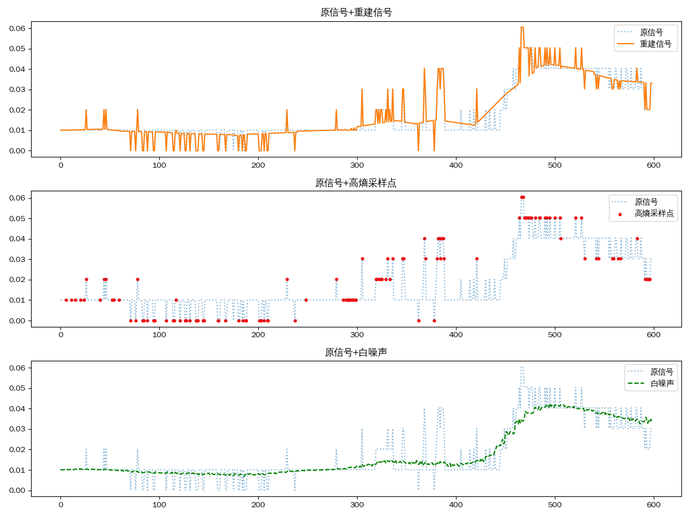

# 基于lesinn的数据压缩

受到lesinn算法的启发，我们开发了数据压缩模块。

1. 白噪声估计与采样：使用 `online_lesinn` 算法对每个窗口的数据进行异常分数计算，分数低的点视为“正常”或“白噪声”。用 `localized_sample` 按分数采样，选出一部分正常点（`normal_indices`），这些点代表数据的基础噪声结构。大概采样5-10%的数据点即可。
2. 插值重建噪声:对每个窗口和每个维度，利用线性插值方法，根据采样到的正常点，重建整个窗口的白噪声估计（noise_estimate）。
3. 数据去噪与异常检测:用原始数据减去估计的噪声，得到去噪后的数据（data_denoised）。再次用 online_lesinn 检测异常分数，分数高的点视为异常点（anomaly_indices）。
4. 压缩存储:只保存部分正常点（5-10%）的索引和值，以及异常点（10-20%）的索引和值。异常点通常是数据中的异常事件或重要变化，噪声点用于还原数据的基础结构。
5. 数据重建:重建时，先用插值方法根据噪声点还原整个数据的基础部分。再将异常点的值覆盖到对应位置，实现高保真重建。

