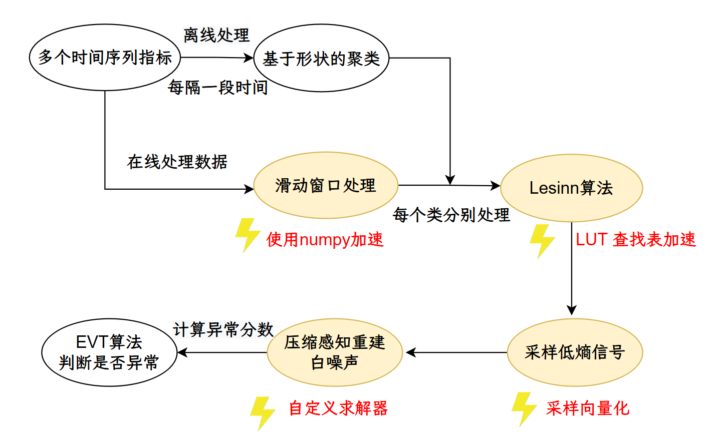

# 压缩感知异常检测

基于深度学习的方法在 AI/ML 工作负载中几乎不适用，因为 AI/ML 工作负载多样化，而且容易受到同一台机器其他应用的影响。比如，如果一个机器上运行了CPU优先级更高的程序，那么 AI 工作负载会降低CPU利用率，上下文切换更加频繁。同时，基于深度学习的方法通常需要长时间的训练数据，而这些数据往往难以取得，而且只适合特定的训练场景，鲁棒性不佳。

现有基于深度学习的方法的平均初始化时间从 10 天到 100 天不等，而且这些方法难以适应工作负载的变化。相比之下，基于压缩感知的异常检测方法，能够在更短的时间内实现高精度的异常检测。

压缩感知基于如下思想，当原始时间序列不包含异常时，原始时间序列和重建的多变量时间序列（仅由低能量分量组成）之间的差异应该类似于白噪声。多变量时间序列中的异常，如抖动、突然下降，通常表现为包含高能分量的强信号，这与白噪声有很大不同。因此，我们可以通过检查滑动窗口中原始时间和重建的多元时间序列之间的差异是否与白噪声非常不同来判断时间序列是否包含异常。

压缩感知通常使用高斯分布从原始时间序列中采样，以保证受限等轴测属性 （RIP）。然而，它可能会采集到异常数据。因此，我们借鉴了项目JumpStater中的抗离群值采样算法，使用LESINN (Local Exceptionality Similarity-based INdex of Nonconformity)方法判断异常分数，采集异常分数低的点，从而从正常的时间序列片段而不是异常片段中采样。

考虑到AI/ML系统中不同监控指标间的关联性往往是未知且动态变化的，我们借鉴了论文、中提出的基于形状聚类算法的思想，无需人工标注数据标签即可实现高精度的异常检测。同时，我们也引入了动态模态分解（VersaGuardian），支持对周期序列的高效检测。

如图，这是压缩感知的流程，首先采集多个系统或应用的时间序列指标，作为原始数据输入。对数据进行离线处理，每隔一段时间，基于指标的形状进行聚类，将数据分为不同类别。在线处理数据时，采用滑动窗口机制，对每个类别的数据分别处理。对每个类别的数据应用 Lesinn 算法进行异常检测。该算法通过查找表（LUT）进一步加速。Lesinn算法输出采样后的低熵信号，并进行向量化采样。利用自定义求解器对采样信号进行压缩感知重建。最后通过 EVT（极值理论）算法计算异常分数，判断当前时间窗口是否存在异常。

[基于相似度的聚类](./sbd.md)

[Lesinn](./lesinn.md)

[凸优化求解](./cvxpy.md)