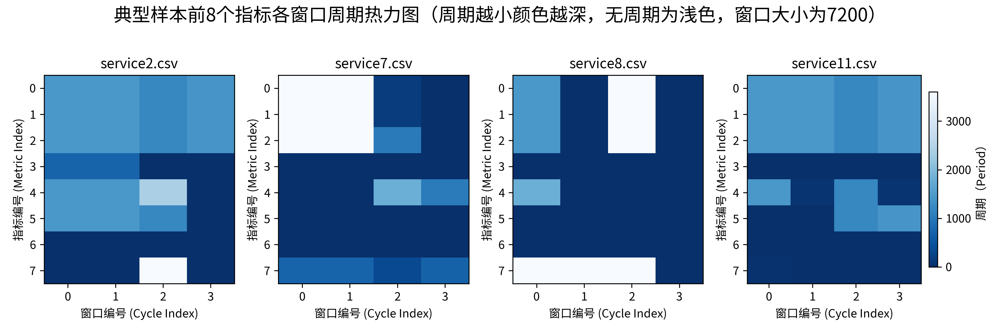
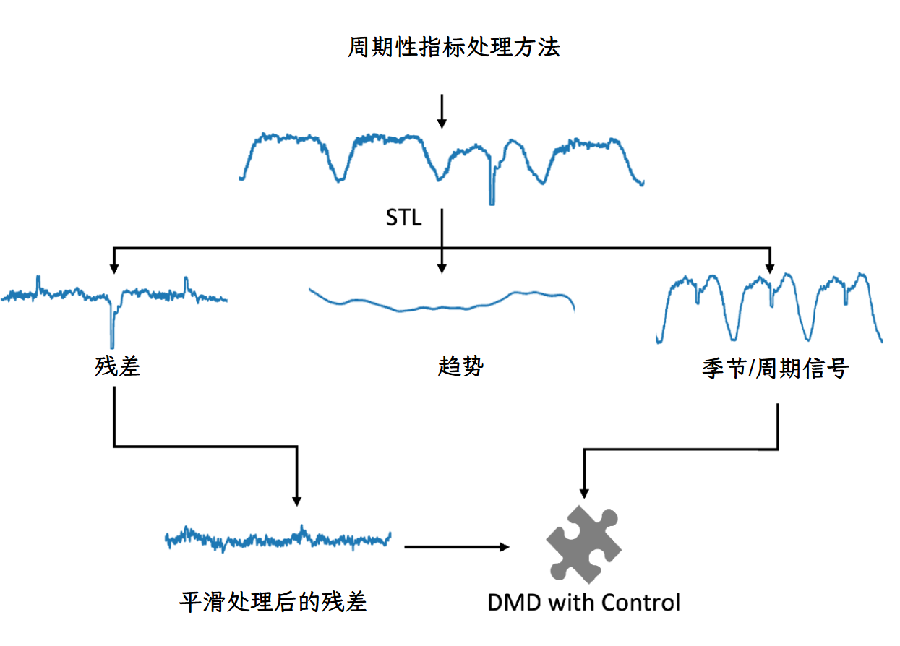
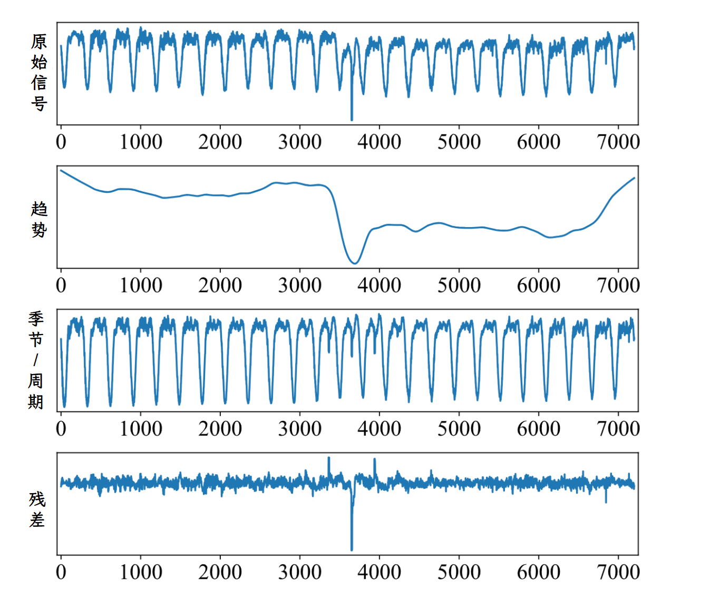

# 动态模态分解

针对周期性数据的异常检测需求，项目引入了动态模态分解（DMD）算法，与压缩感知方法形成互补，有效提升了对周期信号的处理能力，使异常检测的 F1 分数稳定提升至 0.8 左右。

程序首先使用傅里叶变换（Fourier Transform）来检测多变量时间序列中的周期性。如果周期性比较强，就使用动态模态分解（Dynamic Mode Decomposition，简称DMD）来进行异常检测。DMD是一种从高维数据中提取低维动态模态的方法，能够捕捉时间序列中的主要动态特征。


这是周期特征可视化，越深表示周期性越强。

然后，程序根据检测到的周期长度，将具有相似周期的指标聚类在一起。

对于非周期性时间序列，直接使用DMD进行预测。通过DMD预测下一时刻的时间序列值，与原信号进行对比，使用SPOT算法判断阈值，做出预测。

对于周期性时间序列，使用局部加权回归（seasonal-trend decomposition using loess，简称STL）方法。STL将时间序列分解为趋势（trend）、季节（seasonal）和残差（remainder）三个部分。趋势部分表示时间序列的长期变化趋势，季节部分表示周期性变化，残差部分则是去除趋势和季节性后的剩余波动。因为残差往往包含异常部分，程序通过对残差进行滑动平均，过滤到异常值信号。最后程序根据趋势、季节和经过滑动平均后残差，使用DMDc（Dynamic Mode Decomposition with control，简称DMDc）重建出正常信号，与原始信号相比较，使用SPOT算法判断阈值，做出预测。

SPOT (Streaming Peaks-Over-Threshold) 是一种基于统计极值理论的实时异常检测算法，特别适用于连续数据流中的异常点检测，能够动态调整阈值，适应数据分布的变化。该算法基于极值理论中的广义帕累托分布（GPD），采用阈值超越法跟踪超过初始阈值的峰值，根据观测数据实时调整异常检测阈值，具备适应数据分布逐渐变化的自适应能力。算法无需假设数据分布，基于极值理论适应各种数据分布，具有在线学习能力可以实时调整模型参数。

```python
class SPOT:
    def __init__(self, q=1e-4):
        self.q = q  # 风险参数，控制检测灵敏度
        
    def _grimshaw(self, peaks, thresh):
        """使用 Grimshaw 方法估计 GPD 参数"""
        n = len(peaks)
        mean = np.mean(peaks - thresh)
        a = mean
        # 迭代求解 GPD 参数
        for _ in range(100):
            k = 1 + a * np.sum(1 / (peaks - thresh + a))
            a = mean * k / (k - 1)
        return a, 1/a
    
    def _quantile(self, nt, sigma, gamma):
        """计算极端分位数"""
        return sigma * ((nt * self.q)**(-gamma) - 1) / gamma
    
    def run(self, data):
        """在数据流上运行异常检测"""
        thresholds = []
        alarms = []
        for x in data:
            if x > self.current_threshold:
                # 更新阈值
                self.update_threshold(x)
                alarms.append(1)
            else:
                alarms.append(0)
            thresholds.append(self.current_threshold)
        return alarms, thresholds
```
