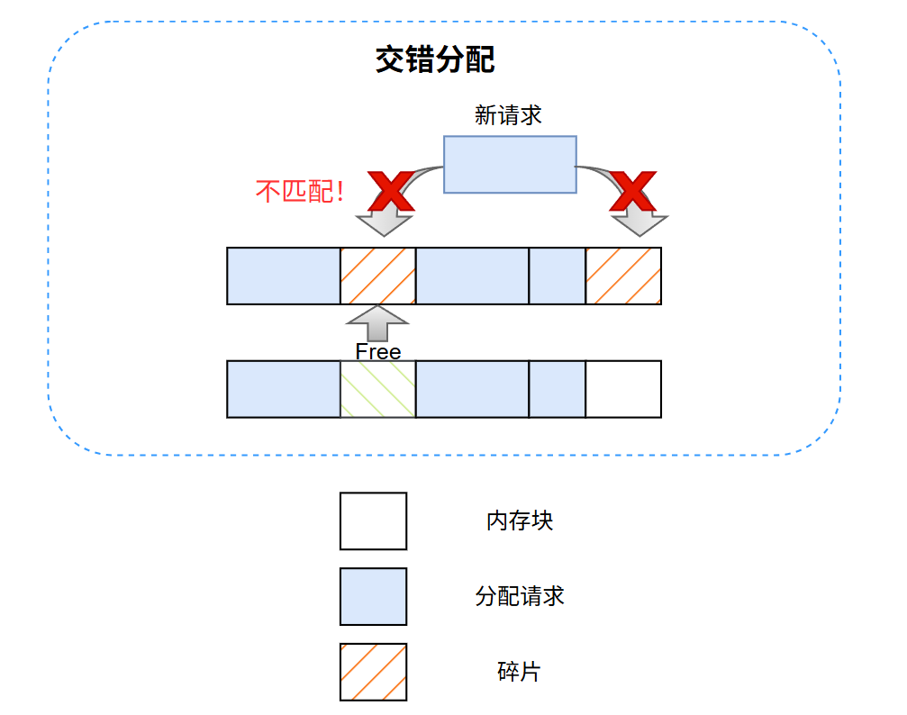
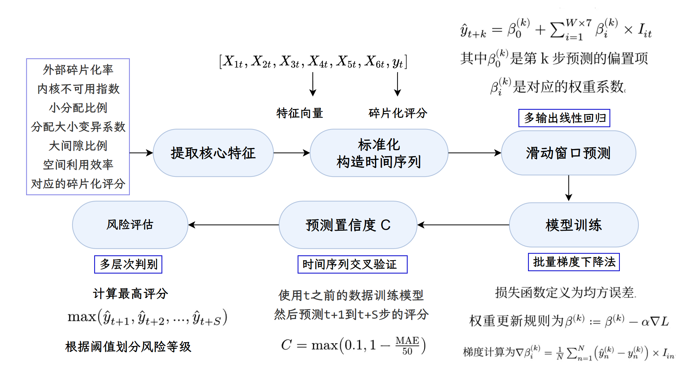
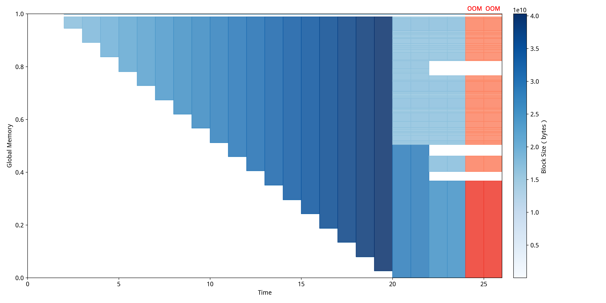

# 显存碎片化检测

显存碎片化检测是整个异常检测系统中最复杂也是最重要的部分，GPU 显存的碎片化会严重影响大块内存的分配，导致内存分配失败或性能下降。显存碎片化检测算法是一个复杂的多阶段分析过程，核心是通过分析GPU内存分配的空间分布模式来量化评估碎片化程度。

如图所示，这是GPU 显存碎片化的典型场景。内存空间被多个分配块（Memory Block）和空闲区域（Fragmentation）交错占用。当有新的内存分配请求（Allocation Request）时，虽然总空闲空间足够，但由于这些空闲区域被分割成多个不连续的小块，无法满足大块连续分配的需求，导致分配失败（Not Match!）。只有当分配请求的大小与某个空闲块完全匹配时，才能成功分配（如图中绿色 Free 区域）。

碎片化的本质在于，大量小块分配和释放操作会导致内存空间被切割成许多不连续的碎片，降低了大块内存的分配成功率。即使整体空闲空间充足，碎片化严重时也会频繁出现分配失败或性能下降。因此，碎片化检测和优化对于提升 GPU 应用的稳定性和性能至关重要。

受学术论文NeutriNo: Fine-grained GPU Kernel Profiling via Programmable Probing 的启发，NeuTracer 从空间和时间角度衡量碎片化程度，采用*MDTP*（Memory Distribution Timeline Plotter）作为可视化方案。

*空间上*，内存碎片化检测算法的设计基于对GPU内存管理特点的深度理解，通过四个核心维度来全面量化内存空间的碎片化程度。上图展示了碎片化考虑的指标。算法首先收集系统中所有活跃的CUDA内存分配信息，包括每个分配块的起始地址、大小以及分配状态，然后将这些分配按地址顺序排列构建完整的内存布局视图。基于这个有序布局，算法计算相邻分配块之间的间隙大小，这些间隙代表潜在的可用内存片段。

外部碎片化率是首要核心指标，其计算公式为
$$
\text{FragmentationRatio} = \frac{\sum_i \text{gap\_size}_i}{\text{TotalAddressSpace}}
$$

即所有间隙总大小与整个地址空间范围的比值。选择这个指标的根本原因在于它直接反映了内存空间中无法被有效利用的比例，是传统操作系统内存管理中最经典的碎片化度量方法。当外部碎片化率较高时，说明大量内存空间被分割成小片段，即使总体可用内存充足，也可能无法满足大块连续内存的分配需求。这个指标特别适用于GPU环境，因为GPU内核通常需要大块连续内存来存储矩阵、张量等数据结构，外部碎片化会直接影响这类分配的成功率。

内核不可用指数是第二个核心指标，其设计灵感来源于Linux内核的内存管理评估机制。算法首先计算目标分配块大小，通常基于历史平均分配大小的两倍并向上取整到最近的2的幂次（GPU倾向于按2的幂次进行内存对齐），目标块大小 $t$ 的计算公式为：
$$
t = 
\begin{cases}
\max\left(2 \cdot 2^{\lceil \log_2 a \rceil},\ p\right) & \text{if } a > 0 \\
p & \text{if } a \leq 0
\end{cases}
$$

式中，$a$ = avg_allocation_size（平均分配大小）
，$p$ = pageSize（GPU页面大小），$t$ = target_block_size（目标块大小）。然后统计所有间隙中能够容纳该目标块大小的空闲块数量free_blocks_suitable。接着计算理论上应该可用的块数量theoretical_blocks，基于总可用页数除以每个目标块占用的页数。内核不可用指数的计算公式为
$$
\text{KernelUnusableIndex} = \left(1 - \min\left(1.0,\ \frac{\text{free\_blocks\_suitable}}{\text{theoretical\_blocks}}\right)\right)^\alpha
$$
其中$alpha$的幂次用于平滑极端值的影响。选择这个指标的理由在于它能够量化内存碎片化对实际分配能力的影响程度，不仅考虑间隙的存在，还评估这些间隙是否具有实用价值。

分配模式评估是第三个核心维度，包含两个子指标：小分配比例和分配大小变异系数。小分配比例计算为小于预设阈值（通常为4MB）的分配数量除以总分配数量，其公式为
$$
\text{SmallAllocationRatio} = \frac{\text{Count}(\text{allocation\_size}_i < 4\ \text{MB})}{\text{TotalAllocations}}
$$
选择这个指标的原因是小分配过多往往是碎片化的重要诱因，GPU内存管理器在处理大量小分配时容易产生内存碎片，而4MB阈值的选择基于GPU页面大小和典型深度学习工作负载的内存使用模式。分配大小变异系数通过计算所有分配大小的标准差与平均值的比值来衡量分配模式的均匀性，公式为
$$
\text{CV} = \frac{\sigma}{\mu}
$$

$$
\sigma = \sqrt{\frac{\sum_i (\text{size}_i - \mu)^2}{n}}
$$
这个指标反映分配大小的离散程度，当分配大小差异很大时，会增加内存管理的复杂性并容易产生难以利用的间隙。

空间效率评估是第四个核心维度，主要通过大间隙比例来量化。该指标首先计算所有间隙的平均大小，然后统计大于平均间隙大小两倍的间隙总大小，最后计算其占总间隙大小的比例，公式为
$$
\text{LargeGapRatio} = \frac{\sum_{i} \text{gap}_i > 2 \times \text{avg\_gap\_size}}{\sum \text{all\_gaps}}
$$
选择这个指标的理由在于它能够识别内存空间中的"热点"和"冷点"分布模式，大间隙比例高表明内存分布极不均匀，存在大片未被充分利用的空间区域。这种不均匀分布虽然暂时不影响小分配，但会降低整体空间利用效率，并可能在未来的内存重分配中造成更严重的碎片化问题。

算法最终通过加权组合这四个维度得到综合碎片化评分，权重分配为外部碎片化率50%、内核不可用指数15%、分配模式评估10%、空间效率评估25%。这种权重设计基于实际GPU应用场景的重要性分析：外部碎片化直接影响分配成功率，因此占据最高权重；内核不可用指数虽然重要但相对复杂，给予中等权重；分配模式更多反映潜在风险，权重相对较低；而空间效率评估涉及长期内存管理效果，给予较高权重以确保系统的可持续性。

*时间上*，内存碎片化预测算法通过构建轻量级的多元线性回归模型来预测未来的碎片化发展趋势。算法流程如上图所示。算法首先将碎片化检测过程中提取的六个核心特征，即外部碎片化率、内核不可用指数、小分配比例、分配大小变异系数、大间隙比例以及空间利用效率与对应的碎片化评分构成时间序列样本。每个时间步t的样本可以表示为$(X_t, y_t)$，其中$X_t = [x_{1t}, x_{2t}, ..., x_{6t}]$是特征向量，$y_t$是碎片化评分。为了处理不同量纲特征之间的差异，算法对所有特征进行Z-score标准化，计算公式为$
x'_i = \frac{x_i - \mu_i}{\sigma_i}
$，其中$mu_i$和$sigma_i$分别是特征i的历史均值和标准差。

时间序列预测模型采用滑动窗口机制，使用固定长度为W的历史窗口来预测未来S个时间步的碎片化评分。对于第k步预测，模型的输入包括当前时刻及之前W个时间步的所有特征以及历史评分，可以表示为输入向量$
I_t = [X_{t-W+1}, X_{t-W+2}, ..., X_t,\ y_{t-W+1}, y_{t-W+2}, ..., y_t]
$，总维度为$W \times 7$。预测模型采用多输出线性回归的形式，第k步预测的数学表达式为，
$$
\hat{y}_{t+k} = \beta_0^{(k)} + \sum_{i=1}^{W \times 7} \beta_i^{(k)} \cdot I_{it}
$$
其中$β_0^{(k)}$是第k步预测的偏置项，$β_i^{(k)}$是对应的权重系数。每个预测步都有独立的权重参数，这样可以更好地捕捉不同时间间隔下的预测规律。

模型训练采用批量梯度下降算法，损失函数定义为均方误差
$$
L = \frac{1}{N} \sum_{n=1}^N (\hat{y}_n - y_n)^2
$$
其中N是训练样本数量。权重更新规则为
$$
\beta^{(k)} := \beta^{(k)} - \alpha \nabla L
$$
其中α是学习率，梯度计算为
$$
\nabla \beta_i^{(k)} = \frac{1}{N} \sum_{n=1}^N (\hat{y}_n^{(k)} - y_n^{(k)}) \cdot I_{in}
$$
为了防止梯度爆炸和权重过大，算法引入梯度裁剪机制，当梯度范数
$
\|\nabla L\|_2  
$超过预设阈值$gamma$时，将梯度缩放为$\frac{\gamma \|\nabla L\|_2}{\nabla L}$，同时对权重进行硬约束，限制在[-10, 10]范围内。训练过程还采用早停策略，当损失函数连续20次迭代不再下降时提前终止，避免过拟合。

预测置信度的计算基于模型在历史数据上的交叉验证性能。算法使用时间序列交叉验证方法，对于每个历史时间点t，使用t之前的数据训练模型，然后预测t+1到t+S步的评分，计算平均绝对误差
$$
\text{MAE} = \frac{1}{M} \sum_{m=1}^M |\hat{y}_m - y_m|
$$
其中M是验证样本总数。置信度计算公式为
$$
C = \max(0.1,\ 1 - \frac{\text{MAE}}{50})
$$
这样设计使得预测误差越小置信度越高，同时保证最低置信度不低于0.1。趋势因子通过线性回归计算历史评分的斜率得出，公式为
$$
\text{slope} = \frac{n \sum x y - \sum x \sum y}{n \sum x^2 - (\sum x)^2}
$$
其中x代表时间索引，y代表评分值，趋势因子反映了碎片化的整体发展方向,可以反映碎片化的时间特性。

风险评估采用多层次判别机制，首先计算预测期内的最高评分
$$
\text{max\_score} = \max(\hat{y}_{t+1}, \hat{y}_{t+2}, ..., \hat{y}_{t+S})
$$
然后根据阈值划分风险等级：评分超过80为严重风险，70-80为高风险，50-70为中等风险，30-50为低风险，30以下为最小风险。预警生成基于多个条件的组合判断，包括预测评分相对当前评分的增幅$\delta = \hat{y}_{t+k} - y_t$、连续时间步之间的跃升幅度$\Delta = \hat{y}_{t+k+1} - \hat{y}_{t+k}$、趋势因子的绝对值以及置信度水平。当$\delta > 5$且置信度超过0.6时触发"显著恶化"预警，当$\Delta > 10$时触发"急剧恶化"预警，当$|"slope"| > 0.3$时触发"趋势明显"预警。这种多维度的预测和预警机制能够提前识别潜在的内存碎片化风险，为系统管理员提供足够的时间窗口来采取预防措施。

为了更好的展示碎片化在时间上和空间上的特征，NeuTracer引入了MDTP（Memory Distribution Timeline Plotter）可视化工具。如@mem-timeline 所示，MDTP是一个专门针对GPU内存碎片化分析的创新可视化方案，它能够将复杂的内存分配状态和碎片化演进过程以直观的时间序列形式呈现给用户。

MDTP采用了独特的二维可视化设计，其中横轴代表时间维度，纵轴代表GPU全局内存地址空间的相对位置。这种设计使得用户能够同时观察到内存分配的空间分布特征和时间演化规律。图中的每个色块代表一个内存分配块，颜色的深浅直接反映了该内存块的大小——深色表示大块内存分配，浅色表示小块内存分配。这种颜色编码方案让开发者能够一眼识别出哪些时间段存在大量小块分配，哪些区域集中了大块连续内存，从而快速定位可能的碎片化热点。同时，图中的空白区域直观展现出了空洞的大小，使我们能够清晰观察到内存碎片化程度及其对系统性能的潜在影响。

MDTP的核心价值在于其能够清晰地展现内存碎片化的动态演进过程。通过观察相邻时间帧之间内存布局的变化，开发者可以发现内存分配模式的规律性，比如是否存在周期性的分配释放行为，是否有特定算法阶段导致的内存碎片激增等。当内存空间中出现大量不连续的小色块时，说明该时间段内存碎片化严重；而当色块呈现较好的连续性和规整性时，则表明内存布局相对健康。

该可视化工具还具备异常事件标注功能，能够在时间轴上清晰标出发生OOM（Out of Memory）异常的精确时间点。这些异常标记通常以红色高亮显示，与正常的蓝色内存分配形成鲜明对比。通过将OOM事件与其发生时刻的内存分布状态进行关联分析，开发者能够准确判断内存不足的真正原因——究竟是GPU物理显存容量达到上限，还是由于严重的内存碎片化导致大块连续内存分配失败(如图@mem-fragment 中的例子所示)。

基于MDTP提供的可视化洞察，开发者能够制定针对性的内存优化策略。当发现碎片化问题时，可以考虑减小批处理大小（batch size）来降低单次内存分配的压力，或者引入内存池技术来统一管理内存分配和回收，从而减少碎片产生。对于PyTorch用户，还可以通过调整max_split_size_mb参数来限制内存分配器的最大分割块大小，这样能够有效降低碎片化率，提高大块内存分配的成功概率，从根本上缓解因碎片化导致的性能问题。