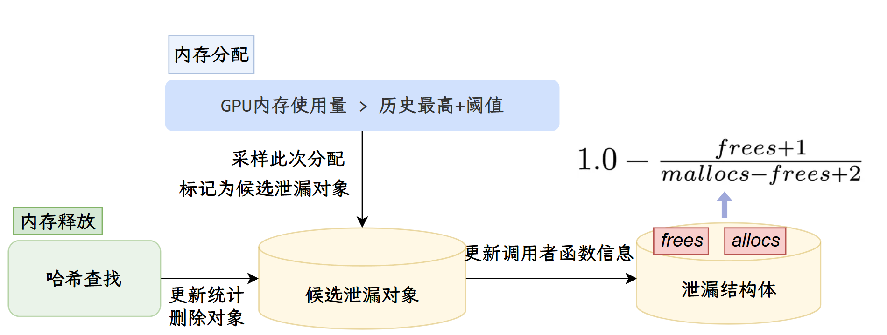

# 内存泄漏检测

NeuTracer的内存泄漏算法受学术论文@berger_triangulating_2022 启发，采用了基于阈值的采样方法。如图所示，这种方法通过设置合理的阈值来选择合适的检测时机，相比传统的基于速率的采样方式，能够更精准地捕获异常内存行为，同时有效降低了系统开销，使得内存泄漏检测既准确又高效。

如@图所示，GPU内存泄漏检测算法完全嵌入在阈值采样框架中，通过持续监控CUDA内存分配和释放操作来实现自动化检测，无需开发者手动设置检查点或插入特殊代码。具体而言，当系统检测到GPU内存使用量相比历史最高水位增长超过预设阈值时，算法会立即触发高水位标记检测机制；一旦确认当前内存使用刷新了历史峰值，便将触发此次采样的内存分配操作记录下来，包括分配地址、大小、调用者函数偏移量以及分配时的全局时间戳，并将该分配标记为"候选泄漏对象"存入内部状态映射表中。

随后的运行过程中，每当CUDA释放函数被调用时，算法都会通过高效的哈希查找来判断正在释放的内存地址是否对应之前记录的某个候选泄漏对象；如果找到匹配项，就在该对象的泄漏分数结构中将frees计数递增，表明该内存已被正确回收，同时更新相关统计信息；如果没有找到匹配，则说明这次释放与之前的候选泄漏无关，mallocs计数保持不变，对象继续保留在候选集合中。当进程的GPU内存使用量再次增长并突破新的历史峰值时，算法重复执行上述采样和记录步骤，不断引入新的候选泄漏对象并维护它们的生命周期统计。

为了精确量化每个分配点的"泄漏嫌疑度"，算法为候选集合中的每个调用者函数维护一个包含多维信息的泄漏分数结构，核心包括mallocs和frees两个计数器：当某个函数位置首次被采样时mallocs初始化为1而frees为0，随着程序运行，同一函数位置的后续分配会增加mallocs计数，而对应的释放操作则会增加frees计数。算法采用拉普拉斯继承规则来计算泄漏概率，公式为$
1.0 - \frac{\text{frees} + 1}{\text{mallocs} - \text{frees} + 2}
$，这种方法能够在有限样本下给出较为保守但可靠的概率估计。同时，算法还会计算内存增长率，通过比较当前总分配大小与首次分配时的基线来衡量该函数位置是否存在持续的内存增长趋势。

当某个调用者函数的泄漏概率超过95\%的置信阈值，且其内存增长率超过1\%的最小阈值时，算法才会向用户报告该位置存在高置信度的内存泄漏风险。在程序结束时，会产生一个报告，报告内容不仅包括泄漏概率和增长率，还会根据该函数的平均分配大小、观测时间窗口以及堆栈信息来计算与报告泄漏速率，帮助开发者识别最严重和最紧急需要修复的泄漏点。整个检测过程对GPU程序性能的影响微乎其微，除了在内存峰值时刻需要进行少量的哈希表插入和更新操作外，日常的分配释放监控只涉及简单的地址查找和计数更新，因此可以在生产环境中长期运行而不会对CUDA应用的执行效率产生明显影响。