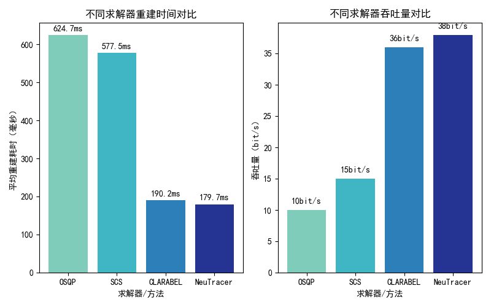
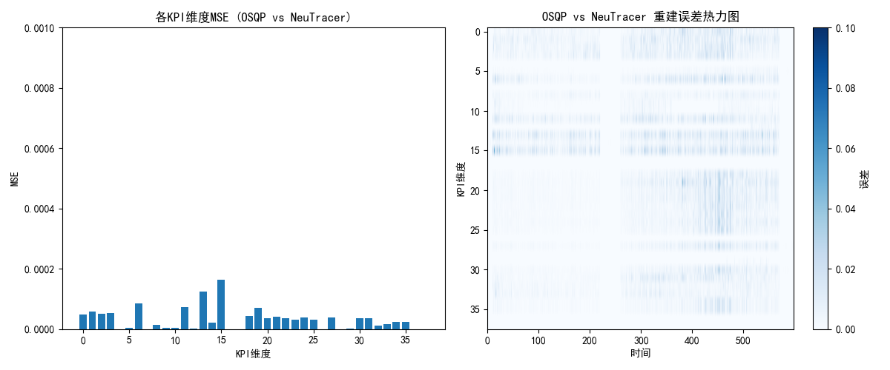

# 压缩感知加速

为提升压缩感知重建算法的实际性能，项目在多个层面进行了优化。源代码使用多个worker进行处理，实际运行时每个worker都会占满整个CPU，经过计算，平均到每个CPU上每秒可以处理23个8维数据点，有时候遇到数据求解更为复杂，速度会更慢。因此，我们对压缩感知算法进行了优化。

首先，核心计算流程采用了 numpy 库进行矩阵运算加速，并对求解问题的结构进行了重构，显著减少了冗余计算，整体平均加速达到 6.2 倍。
## 性能观测
运行profiler后发现，程序主要时间集中在 lesinn算法、sample采样、以及凸优化求解上，在32维数据上大概占比 50%、10%、35%。
## lesinn算法优化

我们使用cuda重写了lesinn，但是发现由于检测窗口较小，数据传输在GPU和CPU开销较大，实际加速比只有2.1左右。

我们注意到，lesinn算法中存在冗余计算。我们需要计算输入数据 $m$个数据点的相似度分数。对于数据点 A，需要从输入数据以及历史数据中随机选择 $"phi"$ 个点，计算 A 与这些点最小欧式距离，取倒数作为相似度分数，这个采样过程发生$t$次，存在重复计算。

因此我们使用查找表算法进行优化。
```py
# 1. 批量计算所有 similarity
similarity_matrix = np.zeros((m, n))
for i in range(m):
    similarity_matrix[i, :] = batch_similarity(incoming_data[i], all_data)

# 2. 采样索引 shape=(m, t, phi)
samples = np.array([
    [np.random.choice(n, size=phi, replace=False) for _ in range(t)]
    for _ in range(m)
])  # shape=(m, t, phi)

# 3. 计算每个点的score
data_score = np.zeros((m,))
for i in range(m):
    score = 0
    for j in range(t):
        nn_sim = np.max(similarity_matrix[i, samples[i, j]])
        score += nn_sim
    if score:
        data_score[i] = t / score
return data_score
```
查找表算法（lookup table），用于加速批量相似度计算。其核心思想是先批量预计算所有数据点之间的相似度，存入查找表（similarity_matrix），后续采样和分数计算直接查表，无需重复计算。

第一步，通过循环将每个 incoming_data 与所有 all_data（历史数据加上输入数据） 的相似度批量计算出来，存入二维相似矩阵，避免后续重复计算。
第二步，samples 随机采样，得到每个数据点的采样索引（哪些数据需要对比）。
第三步，分数计算时，直接用 similarity_matrix[i, samples[i, j]] 查表，取最大值，无需再次计算相似度，极大减少了冗余运算。
查找表算法的优势在于：相似度只算一次，后续采样和分数统计都直接查表，提升了整体计算效率，尤其适合大规模批量处理场景。
## sample采样加速

这里的加速主要体现在采样过程的向量化：
```py
    # 源代码
    while step <= 1:
        for j in range(m):
            c = su_center[j]
            if np.abs(c - step) > 3 * sigma:
                continue
            p = rho * np.exp(np.square((c - step) / sigma) / -2)
            if random.random() < p:
                sample_mat[j][y - 1] += 1
        step += each_step
        while step > t[y] and y < n:
            y += 1
    for row in range(m):
        # 权重归一化
        sample_mat[row] /= np.sum(sample_mat[row])
    sample_mat = np.asmatrix(sample_mat)
    return sample_mat, su_timestamp

    #优化后的代码
    while step <= 1:
        # 向量化所有采样单元
        diff = np.abs(su_center - step)
        mask = diff <= 3 * sigma
        if np.any(mask):
            p = rho * np.exp(-0.5 * ((diff[mask] / sigma) ** 2))
            rand = np.random.rand(np.sum(mask))
            idx = np.where(mask)[0]
            for k, j in enumerate(idx):
                if rand[k] < p[k]:
                    sample_mat[j][y - 1] += 1
        step += each_step
        while step > t[y] and y < n:
            y += 1
    # 权重归一化
    sample_mat /= sample_mat.sum(axis=1, keepdims=True)
    return np.asmatrix(sample_mat), su_timestamp
```
原始实现用两层 for 循环，逐个采样单元和采样步长判断是否采样，效率较低。
现有实现（实际代码）`diff = np.abs(su_center - step)`一次性计算所有采样单元中心与当前步长的距离（向量运算）。`mask = diff <= 3 * sigma`一次性筛选所有满足条件的采样单元。`p = rho * np.exp(-0.5 * ((diff[mask] / sigma) ** 2))`一次性计算所有采样概率）。`rand = np.random.rand(np.sum(mask))`一次性生成所有采样单元的随机数。

## 凸优化求解加速
```py
 # do L1 optimization
    vx = cvx.Variable(d * n)
    objective = cvx.Minimize(cvx.norm(vx, 1))
    constraints = [transform_mat @ vx == b]
    prob = cvx.Problem(objective, constraints)
    prob.solve(solver='OSQP',verbose=False,enforce_dpp=True) # 可以选择 OSQP、SCS、CLARABEL
```
在凸优化求解代码中，问题被转化为如下形式：
$$
\begin{aligned}
&\text{obj:} \quad \min |x|_1 \\
&\text{constraint:} \quad A x = b
\end{aligned}
$$

OSQP 将 L1 最小化问题和线性约束转化为标准二次凸优化形式：
$$ min   \quad (1/2) x^T P x + q^T x \quad
s.t. \quad l <= A x <= u $$
其中$P$为单位矩阵， $q$为全0向量，因为约束为等式约束，因此 $l、u$ 均取 $b$。

但是注意到，这里面引入了二次项系数，因此求解效率不够高。

我们对比了 OSQP 求解器与 SCS求解器、ClArabel 求解器，后两种求解器将L1 最小化问题转换成 LP 问题。OSQP 是一个专门用于求解二次规划（QP）问题的高效求解器，支持带有线性约束的目标函数。它采用 ADMM 算法，能够快速处理大规模稀疏问题。SCS 是一个通用的锥规划（Conic Programming）求解器，支持线性规划（LP）、二次锥规划（SOCP）、半正定规划（SDP）等多种问题。ClArabel 是一个专门用于线性规划（LP）和二次规划（QP）问题的求解器，适合高维稀疏问题，它使用rust编写，因而速度比较快。



我们显式地将问题转换为LP问题：
```py
def compressed_sensing_direct(transform_mat, b):
    """
    直接展开法求解 min ‖x‖₁ s.t. transform_mat @ x == b
    完全替代 CVXPY 的解决方案
    """
    m, n = transform_mat.shape
    
    # 1. 构造线性规划参数
    # 目标函数: min [0,..0, 1,..1] · [x; t]
    c = np.hstack([np.zeros(n), np.ones(n)])
    
    # 等式约束: transform_mat @ x = b → [transform_mat | 0] [x; t] = b
    A_eq = np.hstack([transform_mat, np.zeros((m, n))])
    
    # 不等式约束: -t ≤ x ≤ t → 
    A_ub = np.vstack([
        np.hstack([ np.eye(n), -np.eye(n)]),   # x_i - t_i ≤ 0
        np.hstack([-np.eye(n), -np.eye(n)])    # -x_i - t_i ≤ 0
    ])
    b_ub = np.zeros(2 * n)
    # 2. 求解线性规划 - 使用高效HiGHS求解器
    start_time = time.time()
    res = linprog(c, A_ub=A_ub, b_ub=b_ub, A_eq=A_eq, b_eq=b,
                  method='highs', bounds=(None, None),options={"disp": False})
```

我们实现了压缩感知重建问题的线性规划直接展开法，用于求解带有L1范数约束的稀疏重建问题。其核心思想是将原始的L1范数最小化问题转化为标准线性规划（LP）形式，便于使用高效的LP求解器（如HiGHS）进行求解。linprog 是 SciPy 库中用于线性规划（Linear Programming）求解的函数。它可以高效地解决标准线性规划问题，包括目标函数最小化和线性约束。

原问题
$$
\begin{aligned}
&\text{obj:} \quad \min |x|_1 \\
&\text{constraint:} \quad A x = b \\
\end{aligned}
$$
展开成
$$
\begin{aligned}
&\text{obj:} \quad \min \sum_{i = 1}^n t_i \\
&\text{constraint:} \quad - t_i \leq x_i \leq t_i \\
&\qquad\qquad\quad A x = b \\
&\qquad\qquad\quad t_i \geq 0
\end{aligned}
$$
这种方法完全替代了CVXPY的L1范数最小化方案，计算效率高，适合大规模稀疏重建场景。大概能提升3-4倍的求解速度。同时保证求解精度。经过测试，在2万多个数据点上仅有4个点误差比较大，因为OSQP会经常出现采样率不够导致问题无法求解并自动提高采样率，而LP问题无法做到。

如图，求解器误差较小。

