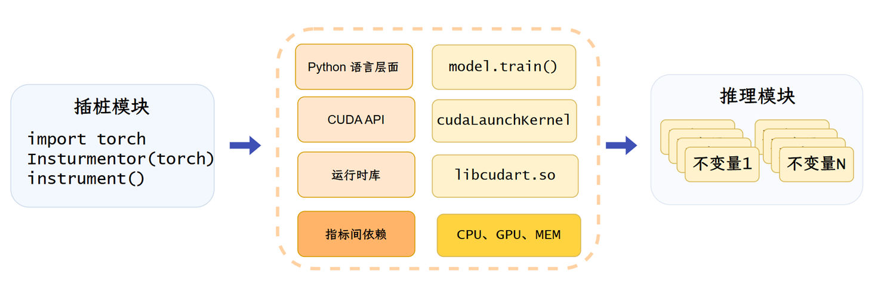
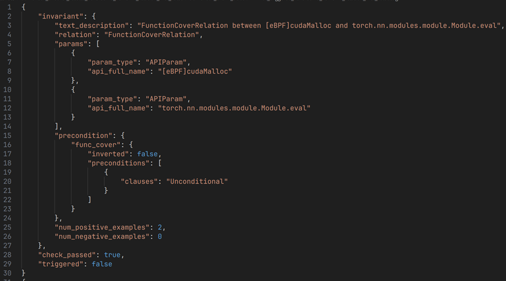

# TrainCheck
TrainCheck 是一款创新的轻量级、可扩展工具，旨在解决深度学习训练管道中普遍存在的"静默"错误问题。该工具通过自动化对现有训练脚本的植入、从"已知良好"正常运行模式中学习运行时不变量，并在新的训练作业中验证这些不变量，从而实现对训练过程中潜在问题的早期发现、预警与精确诊断。

TrainCheck 的核心在于"学习不变量"和"检查不变量"，通过对已知正确运行的训练过程进行深入分析，提炼出程序行为的"黄金法则"，然后在新的训练任务中验证这些法则是否被遵守。系统由三个核心命令行工具构成：Instrumentor（traincheck-collect）负责对目标深度学习训练程序进行自动化植入以收集运行时日志，Inference Engine（traincheck-infer）收到日志并自动推断出运行时不变量及其前提条件，并把它们加入痕迹数据当中，Checker（traincheck-check）在新的训练作业运行期间验证实时或历史痕迹数据是否满足推断出的不变量。如果不满足，则认为有可能发生异常。

Instrumentor 通过动态补丁在运行时为目标程序中的函数和方法注入包装器，专注于追踪关键的长生命周期可变对象如 torch.nn.Module、torch.optim.Optimizer 和 torch.Tensor 的属性修改。为了降低日志记录开销，系统不会记录整个张量的值，而是记录其哈希值、形状、数据类型以及它们之间的相等关系。Inference Engine 定义了三种核心不变量关系类型：Consistent 关系断言实体在特定上下文下应保持一致性，EventContain 关系断言子事件必须发生在父事件持续时间内，APISequence 关系定义 API 的调用顺序和共同出现关系。

TrainCheck 在真实世界的静默错误检测中表现出色，在包含 20 个真实世界静默 bug 的基准测试中成功检测到 18 个，所有检测均在训练开始后的最多 1 次迭代内发生。在检测到的 18 个案例中，TrainCheck 的违规报告在 10 个案例中精确指向了根本原因，在 8 个案例中定位到接近根本原因的位置。系统还成功在 DeepSpeed 和 Transformers 等热门库中发现了 6 个此前未知的静默 bug，其中 3 个已得到官方确认并促成修复。不变量具有良好的可迁移性，从 PyTorch 2.2.2 推断出的不变量在 PyTorch 2.5.1 版本中仍有 94.2% 保持有效。

通过扩展系统调用级别的监控能力，我们可以更早、更准确地检测深度学习训练中的配置错误和性能异常。

我们通过数据收集模块，集成了 eBPF 技术，把如cudaMalloc 等 CUDA API 调用输入TrainCheck, 同时额外设计了不变量关系。在实际测试中，额外检出 5%~10% 违反的不变量关系。比如，在一个测试中，推理出的不变量数从910增加到933，检测到违反的不变量数从510增加到533，额外检测出23个不变量关系。
