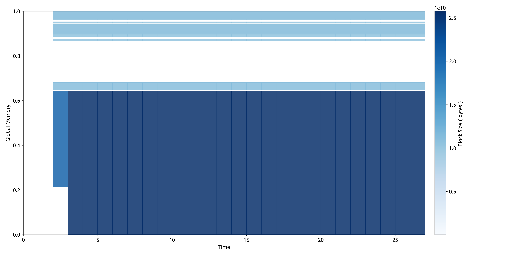
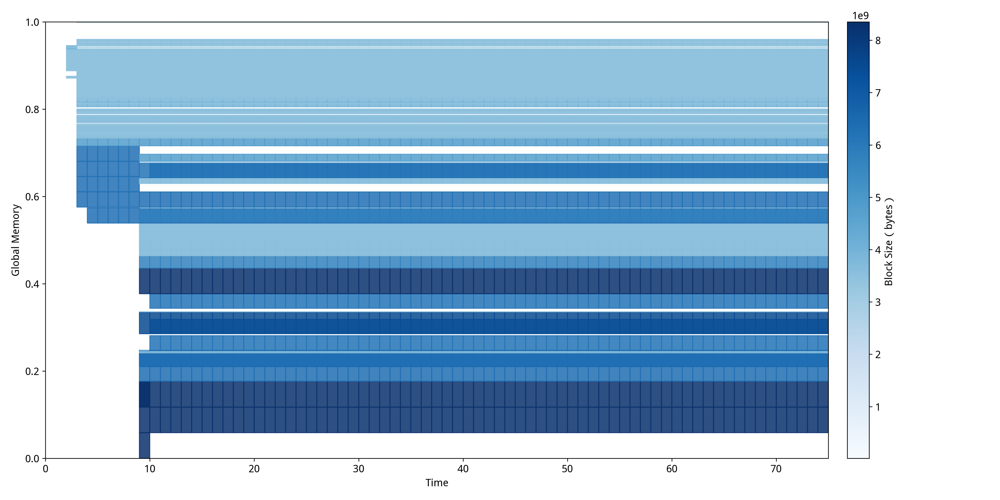

# 项目测试

## NeuTracer 项目测试环境指标

本项目得到哈尔滨工业大学（深圳）实验与创新实践教育中心（分析测试中心）支持，提供了服务器环境进行测试。以下是测试环境的详细配置：

| **指标**  | **值**                     |
| :-------------- | :------------------------------- |
| Linux 发行版    | Ubuntu 20.04                     |
| Linux 内核版本  | 5.15.0                           |
| 机器模式        | 虚拟机                           |
| 内存大小        | 384G                             |
| 硬盘大小        | 500G                             |
| 处理器总核数    | 64                               |
| GPU             | NVIDIA A100 × 4（40GB 显存/卡） |
| Nvidia-smi 版本 | 560.35.05                        |
| CUDA 版本       | 12.6                             |
| 机器环境        | Native 环境                      |

本项目测试了和各主流大模型推理/训练框架的兼容性，具体如下（由于Llama.cpp不依赖Python，Python端没有生效）：

同时，由于时间、知识以及相关算力资源的因素，我们使用 Huggingface Transformers 微调进行测试。

| 训练/推理框架                  | GPU侧功能 | Python 端功能 | Linux OS层功能 |
| ------------------------------ | --------- | ------------- | -------------- |
| Llama.cpp(推理)                | ✅ 支持   | 🟡不支持      | ✅ 支持        |
| Huggingface Transformers(推理) | ✅ 支持   | ✅ 支持       | ✅ 支持        |
| vllm(推理)                     | ✅ 支持   | ✅ 支持       | ✅ 支持        |
| Huggingface Transformers(训练) | ✅ 支持   | ✅ 支持       | ✅ 支持        |

NeuTracer 旨在面向全栈场景，我们在以下核心维度（**三个功能、三个异常、一个开销**）进行了系统性功能和鲁棒性测试：

| **测试样例**             | **主要测试点**     | **通过情况** |
| :----------------------------- | :----------------------- | :----------------- |
| **Python 端功能测试**    | 调用栈采集、火焰图准确性 | PASS               |
| **GPU 侧功能测试**       | CUDA 事件收集完整性      | PASS               |
| **Linux OS 层功能测试**  | CPU、内存、GPU、IO收集   | PASS               |
| **GPU 侧异常检测测试**   | 内存及 CUDA API 相关异常 | PASS               |
| **神经网络异常检测**     | 模型卡死、静默异常检测   | PASS               |
| **压缩感知异常检测测试** | 信号重建、时序异常检测   | PASS               |
| **开销测试**             | 运行时监控性能开销       | PASS               |

## 4.1 Python 端功能测试

**此处对应全栈图的 LLM 训练/推理框架层（Pytorch）。**

本项目收集了Python训练程序(`python/test/cifar.py`)的调用栈数据，离线处理，可视化展示如下：

### 4.1.1 python函数图


该图展示了NeuTracer对Python CIFAR训练程序的函数级性能监控结果，成功识别出92个不同的函数调用，总计33543次函数执行。其中apply_pooling函数成为最大性能热点，占用7.29%的 Self CPU 时间和1501次调用；run_deep_learning_operations函数占用6.82% Self CPU 时间，执行1536次；而总模块占用97.28%的总CPU时间。测试结果证明了NeuTracer基于eBPF栈回溯技术的有效性。

### 4.1.2 python调用栈


该火焰图清晰展示了NeuTracer对PyTorch CIFAR训练程序的完整调用链追踪能力，成功捕获了从主线程到深层嵌套函数的所有执行路径。图中可以看到以main_thread为起点的完整调用栈，包含了pytorch_ext.py模块中的核心训练函数、数据处理函数以及各种环境配置函数的调用关系。火焰图的宽度表示函数执行时间占比，深颜色代表Self CPU 占用，浅颜色代表 Total CPU 占用，通过这种可视化方式，开发者可以直观识别出性能热点函数和调用瓶颈位置。

### 4.1.3 python火焰图


## 4.2 GPU 侧功能测试

**此处对应gpu层**

### 4.2.1 调用栈

我们收集了模型index-1.9b-chat推理时的CUDA内核启动事件的调用栈数据，离线处理,  绘制出的火焰图如下：


该火焰图清晰展示了NeuTracer对CUDA内核启动事件的完整调用链追踪能力，成功捕获了底层CUDA内核执行的调用路径。图中可以看到以主线程为起点的完整调用栈，包含了 `at::naive::vectorized`等PyTorch张量操作函数以及具体内核函数的嵌套调用关系。开发者可以直观识别出频繁调用的内核函数、PyTorch操作的性能热点以及CUDA内核启动的调用瓶颈，从而精确定位GPU计算密集型操作和优化目标。

### 4.2.2 事件统计

我们收集了模型index-1.9b-chat推理过程中的CUDA内核启动事件的数据，获取了内核启动事件的调用次数，并在grafana中实时显示调用次数较多的事件。通过实时监控CUDA内核启动事件的调用频次，能够即时识别GPU计算热点和性能瓶颈。


### 4.2.3 CUDA内存事件

#### CUDA内存分配

我们使用自己构建的神经网络测例(`test/pytorch_ex2.py`)并收集了其运行过程中多进程分配的CUDA内存数据，并可视化在grafana中，如图：


该图直观呈现了各进程内存分配的动态变化趋势，清晰展示了内存使用随时间的演化过程。

#### CUDA内存传输

同样的，我们也捕获了不同类型事件的实时的内存传输速率，并可视化在grafana中，如图：


通过监控多进程CUDA内存分配和内存传输速率，能够精确识别内存使用模式和数据传输瓶颈。

## 4.3 Linux OS 层功能测试

**此处对应Linux OS层**

NeuTracer 同样支持 OS 层及多机网络的性能与异常检测，覆盖 CPU/内存/IO/网络各类指标，首先每个指标结构体都包含时间戳 进程ID 线程ID、以及进程名称。

| 结构体                  | 字段说明                                                                                                                                                                                                                                                                                                                                                                |
| ----------------------- | ----------------------------------------------------------------------------------------------------------------------------------------------------------------------------------------------------------------------------------------------------------------------------------------------------------------------------------------------------------------------- |
| **CPUTraceItem**  | ppid：父进程ID <br>cpu_id：CPU编号 <br>oncpu_time：运行时间(微秒)<br>offcpu_time：等待时间(微秒)<br>utilization：CPU利用率(%)<br>migrations_count：CPU迁移次数 <br>numa_migrations：NUMA迁移次数 <br>hotspot_cpu：热点CPU <br>hotspot_percentage：热点占比                                                                              |
| **FuncTraceItem** | event_type：事件类型(ENTER/EXIT)<br>cookie：唯一标识 <br>call_count：调用次数 <br>avg_duration_us：平均持续时间(微秒)                                                                                                                                                                                                                                       |
| **IOTraceItem**   | operation：操作类型(读/写)<br>bytes：传输字节数 <br>latency_ms：操作延迟(毫秒)<br>device：设备名称 <br>major：主设备号 <br>minor：次设备号 <br>read_bytes：累计读取字节 <br>write_bytes：累计写入字节 <br>read_ops：读操作次数 <br>write_ops：写操作次数 <br>avg_read_latency：平均读延迟 <br>avg_write_latency：平均写延迟 |
| **MemTraceItem**  | operation：操作类型(alloc/free)<br>size：分配/释放大小(字节)<br>addr：内存地址 <br>stack_id：栈ID <br>total_allocs：总分配次数 <br>total_frees：总释放次数 <br>current_memory：当前内存使用量 <br>peak_memory：峰值内存使用量                                                                                                               |
| **NetTraceItem**  | is_send：发送或接收 <br>bytes：传输字节数 <br>src_addr：源IP地址 <br>dst_addr：目标IP地址 <br>src_port：源端口 <br>dst_port：目标端口 <br>protocol：协议 <br>tx_bytes：总发送字节数 <br>rx_bytes：总接收字节数 <br>tx_packets：总发送包数 <br>rx_packets：总接收包数 <br>active_connections：活跃连接数量                   |

对于系统调用、总线以及 NVLink 模块，我们并没有传输到服务端，仅保留在本机日志中。
| 结构体              | 字段说明                                                                                                                                                                                                                                                      |
|---------------------|---------------------------------------------------------------------------------------------------------------------------------------------------------------------------------------------------------------------------------------------------------------|
| **nvlink_event**    | type：事件类型<br>func_id：NVLink函数ID<br>dst_addr：目标地址<br>src_addr：源地址（memset时为值）<br>size：大小/长度<br>ret_val：返回值（strcpy/memcpy为目标指针，memset为目标指针） |
| **pcie_event**      | type：事件类型<br>op_type：PCIe操作类型<br>bus：总线号<br>devfn：设备功能号<br>offset：偏移量<br>size：访问大小<br>value：写入值或读取结果                                             |
| **dma_fence_event** | type：DMA Fence事件类型<br>context：Fence上下文<br>seqno：序列号<br>duration_ns：等待时长（仅wait_end事件有效）                  |
| **syscall_event**   | type：事件类型<br>syscall_id：系统调用号<br>call_id：调用唯一标识<br>args[6]：系统调用参数（enter时有效）<br>ret_val：返回值（exit时有效）|

## 4.4 GPU 相关异常检测

我们使用自己构造的一些会引发CUDA异常的测试样例完成了以下的测试

### 4.4.1 CUDA API调用异常

我们构造一个典型的会引发CUDA API调用异常的例子：在对Llama-8B模型进行微调训练的过程中，人为将batch_size参数设置为一个超出系统承载能力的极大值，导致显存溢出而使训练任务无法正常启动。


可见NeuTracer成功检测出了我们构造的分配大内存的CUDA API调用错误。

### 4.4.2 CUDA内存不足异常

类似的，我们构造了一个典型的内存不足例子：在对Llama-8B模型进行微调训练的过程中，人为将batch_size参数设置为较大值，在训练的过程中会导致显存溢出而使训练无法完整进行。


可见NeuTracer给出了内存不足的警告，并给出了最近一次CUDA内存分配失败的位置，并且还可以结合我们在[4.4.1节](#441-cuda-api调用异常)中检测到的错误综合分析。

### 4.4.3  CUDA内存泄漏异常

我们使用了两个经典的内存泄露例子进行检测。第一个例子通过不断创建大量张量并只释放极少部分，导致大部分张量持续占用显存，从而模拟出内存泄漏现象，可以观察到显存使用量不断增加且无法回收。第二个例子是一个较为隐蔽的内存泄漏案例，是PyTorch中因计算图累积导致的内存泄漏。代码在GPU上不断创建新张量并累加到一个持久变量上，每次操作都调用 `requires_grad_()`来构建计算图，这些计算图会随着循环持续累积在显存中无法释放，最终导致GPU显存使用量不断增长，形成内存泄漏。
```python
# 内存泄漏测例1
import torch
import gc
import os
import time

def create_and_hold_tensor(device,num_iterations=1000):
    # 创建一个大的张量并存储在列表中
    tensors = []
    for i in range(num_iterations):
        for _ in range(100):
            # 分配一个大的张量到GPU
            tensor = torch.randn(100, 100, device=device)
            tensors.append(tensor)
        
        # 只释放一小部分张量
        for _ in range(10):
            tensor_to_free = tensors.pop()
            del tensor_to_free
        print(f"Iteration {i+1} completed, {len(tensors)} tensors held in memory.")
        gc.collect()
        torch.cuda.empty_cache()

device = torch.device("cuda" if torch.cuda.is_available() else "cpu")
create_and_hold_tensor(device,500)
```

```python
# 内存泄漏例子2
import torch
import os
import psutil

def leak():
    use_cuda = torch.cuda.is_available()
    print(f"Using CUDA: {use_cuda}")
    val = torch.rand(100,100,device="cuda") 
    count = 0
    log_iter = 20000
    while True:
        value = torch.rand(100,100,device="cuda") 
        val += value.requires_grad_()
        count += 1

if __name__ == "__main__":
    leak()
```


可见NeuTracer会给出实时的内存泄漏警告，并在程序结束后给出详细的内存泄漏报告。

同时，NeuTracer会持续追踪进程状态，一旦发现带有内存分配记录的进程已终止却存在未释放内存的情况，会发出内存泄漏警告。

可见NeuTracer给出了进程异常终止导致的内存泄漏的警告，反映了没有cudaFree的内存总量与记录数量。

### 4.4.4 CUDA显存碎片化异常

我们构造了一个典型的显存碎片化例子。这个例子通过分配大量小块张量并有选择地释放部分块，主动在GPU显存中制造多个较大的“空洞”，从而模拟显存碎片化的典型场景。程序首先分配数万个小张量，随后随机释放一部分小块，再进一步创建几个较大的空洞，最终尝试分配一个大块张量以验证碎片化对大块分配的影响。
```python
# 碎片化测例1
import torch
import time
import random

def create_memory_holes(small_blocks, hole_count=3, min_hole_size=5, max_hole_size=15):
    """
    在内存块列表中创建几个较大的空洞
    
    参数:
        small_blocks: 内存块列表
        hole_count: 要创建的空洞数量
        min_hole_size: 每个空洞最小包含的块数
        max_hole_size: 每个空洞最大包含的块数
    """
    ......

device = "cuda:0"

print("Allocating small blocks to create fragmentation...")
small_blocks = []
for _ in range(79000):  
    tensor = torch.randn(128*1024, device=device)  
    small_blocks.append(tensor)
    time.sleep(0.001)  

print(f"Memory after small allocations:")
print(torch.cuda.memory_summary())

print("\nRandomly freeing blocks to create gaps...")
indices_to_free = random.sample(range(len(small_blocks)//2), len(small_blocks)//8)
print(f"Selected {len(indices_to_free)} blocks to free")

for idx in indices_to_free:
    small_blocks[idx] = None

import gc
gc.collect()
torch.cuda.empty_cache()

small_blocks = [x for x in small_blocks if x is not None]
time.sleep(10)

small_blocks = create_memory_holes(small_blocks, hole_count=3, min_hole_size=2500, max_hole_size=5000)
gc.collect()
torch.cuda.empty_cache()
small_blocks = [x for x in small_blocks if x is not None]


time.sleep(10)

print(f"Memory after freeing blocks:")
print(torch.cuda.memory_summary())

print("\nTrying to allocate a large block...")
try:
    large_block = torch.randn(10*1024*1024*1024//4, device=device) 
    print("Successfully allocated large block!")
except RuntimeError as e:
    print(f"Failed to allocate large block: {e}")

print(f"\nFinal memory state:")
print(torch.cuda.memory_summary())


print("\nWaiting for 10 seconds...")
time.sleep(10)

del small_blocks
if 'large_block' in locals():
    del large_block
torch.cuda.empty_cache()

```


可见NeuTracer基于CUDA地址的分布给出了综合性的分析并给出了评分和相关碎片化指标等详细信息，同时给出了接下来几个时间步预测的碎片化分数，这有利于针对性优化显存碎片化异常。


上图即我们使用的可视化方案MDTP，从中可以看到，显存碎片化导致的极端现象非常明显。随着时间的推移，显存空间先是逐步被大量张量填满，整体内存利用率不断下降，之后释放了一些小块形成了许多小碎片，最后创建了几个较大的空洞，最终在系统尝试分配大块张量时出现了明显的OOM（Out Of Memory）异常。图中右侧的红色区域清楚地标记了分配失败的时间，内存空间中间的大片空白则代表着由于碎片化产生的“空洞”，这些空间虽然总量可观，却无法满足大块分配的需求，因此导致了分配失败。

### 4.4.5 GPU异常检测案例研究

#### 传统注意力 vs FlashAttention

我们选取了使用传统注意力机制和FlashAttention进行推理的两个样例进行测试。传统注意力机制和FlashAttention都是Transformer模型中的核心组件，用于计算序列中不同位置之间的关联性。传统注意力机制采用标准的矩阵乘法实现，即先计算查询(Query)和键(Key)的乘积得到注意力分数矩阵，再与值(Value)相乘得到输出，这种方法在处理长序列时会产生巨大的中间矩阵，占用大量GPU显存。FlashAttention的核心优化在于重新设计了注意力计算的内存访问模式，通过分块(tiling)技术将大矩阵分解成小块进行计算，并利用GPU的高速片上内存(SRAM)而非慢速的高带宽内存(HBM)来存储中间结果，同时采用在线softmax算法避免存储完整的注意力矩阵。

传统注意力机制的MDTP:

FlashAttention的MDTP:

通过对比这两张MDTP，可以清楚地看到传统注意力机制和FlashAttention在内存使用模式上的根本性差异：

传统注意力机制中呈现出"层次化稳定模式"，显存使用率在整个推理过程中保持相对稳定，主要原因是传统注意力需要在前向传播开始时就分配完整的注意力矩阵空间，这些大块内存区域会持续占用显存直到计算完成。图中可以看到几个明显的水平带状区域，这些区域在时间轴上保持连续且稳定，反映了传统注意力"一次性分配大块内存"的特点，虽然内存使用效率不高，但分配模式相对简单规整。

FlashAttention中则展现出截然不同的"动态分块模式"，内存分配呈现明显的阶段性和波动性特征。在推理的前半段可以观察到密集的深蓝色区域，这对应FlashAttention的分块计算阶段，可以发现块的大小明显小于使用传统注意力机制时分配的块大小，这正是FlashAttention通过分块技术实现的优化效果，可以用更少的显存占用完成同样的任务。推理后半段出现的浅色区域和空白区域表明内存被高效释放和重用，这正是FlashAttention通过SRAM缓存和及时释放HBM内存实现的优化效果，证明了其在长序列处理中的显存优势和更灵活的内存管理策略。

#### 碎片化导致的训练失败

我们选取了[基于PyTorch论坛真实案例](https://discuss.pytorch.org/t/unable-to-allocate-cuda-memory-when-there-is-enough-of-cached-memory/33296)构造的碎片化导致训练失败的实验进行测试。该案例源于一个典型的GPU显存分配失败问题，其中系统显示有足够的缓存内存但仍无法完成分配操作。由于原始论坛帖子未提供具体的复现代码，我们在Llama-8B模型微调训练框架中重现了这一异常场景。实验通过以下配置策略主动引入内存碎片化：将批处理大小设置为接近显存容量上限的数值以增加内存分配压力；禁用内存固定机制（dataloader_pin_memory=False），使数据加载过程无法利用页锁定内存的连续性保证，导致内存分配呈现随机化和非连续性特征；将数据加载工作进程数设置为零（dataloader_num_workers=0），强制系统采用单进程同步加载模式，避免了多进程环境下的内存预分配优化机制，使每次数据批次加载都需要进行临时的显存申请操作。通过这些配置的组合作用，成功复现了与原始论坛案例相似的OutOfMemory错误模式，如下图所示。


利用NeuTracer对该异常程序进行监测后得到 
从图中可以清晰地看出，在训练准备阶段就发生了OOM异常，在尝试了几次分配之后训练得以正常进行，然而在后续的训练过程需要分配更大的内存用于训练时发生了OOM异常，导致程序直接终止。可以发现此时存在一些内存空洞，导致无法分配连续的大块。

从图中可以清晰地观察到GPU显存的碎片化演进过程。在训练初始阶段（时间0-10），系统即出现多2次OOM异常，表现为图中红色标记的分配失败事件，此时内存块分布有碎片化的趋势。随着训练进程推进到中期阶段（时间10-60），虽然系统通过多次重试实现了部分内存分配的成功，但显存空间中仍存在大量间隙和空洞，这些碎片化区域在图中表现为蓝色内存块之间的白色空隙。当训练进入后期需要分配更大连续内存块用于梯度计算和参数更新时，由于无法找到足够大的连续空间，再次触发OOM异常并导致程序终止，这一过程在时间轴末端的红色区域得到清晰体现。


针对检测到的碎片化问题，我们实施了系统性的优化策略来验证修复效果。优化方案包括：重新启用内存固定机制（dataloader_pin_memory=True），确保数据在主机内存中以页锁定形式连续存储，减少主机到设备传输过程中的内存碎片产生；配置适当数量的数据加载工作进程（dataloader_num_workers=2），利用多进程并行加载的内存预分配特性，使内存分配模式更加规整和可预测；启用冗余列移除功能（remove_unused_columns=True），减少不必要的数据传输和内存占用，避免因冗余数据导致的额外内存碎片；启用批次尾部丢弃机制（dataloader_drop_last=True），确保所有训练批次具有一致的大小，消除因不完整批次造成的内存分配不均匀现象；通过环境变量PYTORCH_CUDA_ALLOC_CONF设置max_split_size_mb参数为3950MB，限制内存分配器的最大分块尺寸，防止过度细分导致的小块内存碎片累积。这些优化措施通过改善内存分配的时空局部性和连续性，显著提高了GPU显存的利用效率，使原本因碎片化导致失败的大块内存分配得以成功执行，训练过程恢复正常运行状态。针对修复后的程序，我们再一次运行NeuTracer，得到的MDTP如下图所示。



经过系统性优化策略修复后，从图中可以明显观察到显存使用模式的根本性改善。修复后的MDTP展现出截然不同的"紧凑型分布"特征：内存块在空间上呈现更加连续和规整的排列模式，深蓝色区域表示的大块连续内存分配明显增多，而碎片化导致的空白间隙显著减少。整个训练过程（时间0-70）中未出现任何红色OOM标记，表明内存分配策略的优化有效解决了碎片化问题。特别值得注意的是，修复后的内存分配呈现出明显的分层结构，不同大小的内存块能够有序排列，避免了碎片化现象的产生，使得训练程序能够稳定运行至完成。

## 4.5 神经网络相关异常检测

**此处对应训练/推理框架(Pytorch)层**

### 4.5.1 模型卡死检测

我们将正在训练的神经网络手动卡死在一个阶段，此时可以发现我们的CUDA调用栈和python调用栈会停止输出，此时可查看终端的输出内容并据此判断模型具体卡死在了什么位置。


### 4.5.2 静默异常检测

我们使用Traincheck,检测MNIST分类任务神经网络训练过程中的不变量(`invariants.json`)，过程中输出如下：


最终检测得到违反了不变量，进而说明了该神经网络的训练过程产生了静默异常（通过检查违反的不变量关系在训练代码中的实际对应，可定位静默异常最初发生错误的代码位置）。

我们把eBPF收集到的cudaMalloc等函数输入，新增待检测的关系，推理出的不变量数从910增加到933，检测到违反的不变量数从510增加到533，额外检测出23个不变量。

## 4.6 压缩感知模块

**此处对应Linux OS层的综合数据指标判断与分析**

### 4.6.1 异常检测效果测试

由于缺少跟AI/ML负载有关的数据集，我们采用了论文JumpStarter中给出的云原生数据集，该数据集来自大型互联网公司A的真实生产环境，每个数据集包括27个样本。


| 数据集ID | 异常比率 | 数据维度 | 长度  |
| -------- | -------- | -------- | ----- |
| dataset1 | 4.16%    | 38       | 23706 |
| dataset2 | 5.25%    | 19       | 7200  |
| dataset3 | 20.26%   | 19       | 7200  |


NeuTracer 结合了压缩感知方法与动态模态分解方法，根据周期特征灵活选择这两个方法，理想的F1分数表示的是两个方法中对数据集里面的每个样本取最高的F1分数。


### 4.6.2 压缩感知速度测试


我们的加速大概在5-7倍左右，平均加速比为6.2倍。


此外，项目还基于 Osqp 和 Eigen 的 C++ 库实现了压缩感知算法的高性能 C++ 版本。由于时间有限，加上压缩感知的数学问题形式比较复杂，我们为了保证算法正确性，简化了一些并行逻辑，因此加速比只有2.3倍。未来预计对 压缩感知C++版本 进行进一步优化。


## 4.7  NeuTracer 性能测试

### 4.7.1 对比PyTorch Profiler性能测试

在本部分测试中，我们主要关注收集Python语言、Pytorch API调用层面带来的时间开销。


以上测试的Pytorch Profiler一项，是人工对训练/推理过程添加插桩代码，使用Pytorch Profiler监测函数调用信息，测试得到的结果。

### 4.7.2 对比Nsight Systems性能测试

在本部分测试中，我们主要关注收集CUDA启动事件，CUDA内存事件及其余CUDA API调用带来的时间开销。


以上测试的nsys是仅跟踪CUDA事件的时间开销。可以发现，NeuTracer的此模块性能开销很低，不超过5%。

注意图中的CIFAR表示用卷积神经网络完成CIFAR-10数据集分类任务。

## 4.8 补充测试

我们将NeuTracer收集的GPU相关数据与其他分析工具的分析结果进行对比。

### 4.8.1 内核启动事件统计

我们使用index模型的推理作为测试，与Nsight System对比，统计了调用次数前五的内核启动事件数量，结果如下：


可以看到我们的统计达到了100%的正确率。

### 4.8.2 内存传输事件

我们使用index模型的推理作为测试，与Nsight System对比，统计了H2D(主机到gpu)和D2H(gpu到主机)两个事件我们捕捉到的内存传输总量，结果如下：


可以看到我们的统计达到了99.9%的正确率。


### 4.8.3 内存使用事件

我们将 NeuTracer 收集到的结果和pytorch自带的 `cuda.memory_allocated`统计的内存分配对比，使用index推理模型测出来的内存使用趋势曲线与内存使用分布如下：


可见 NeuTracer 可以很好地反映模型推理过程中的内存变化与内存使用分布。图中NeuTracer 会比PyTorch记录的内存大一点，这是因为PyTorch还有缓存机制，会先缓存一部分CUDA内存避免重复调用 `cudaMalloc` 和 `cudaFree` 函数， NeuTracer 捕获的内存总量可以更好的反映当前gpu的使用情况。