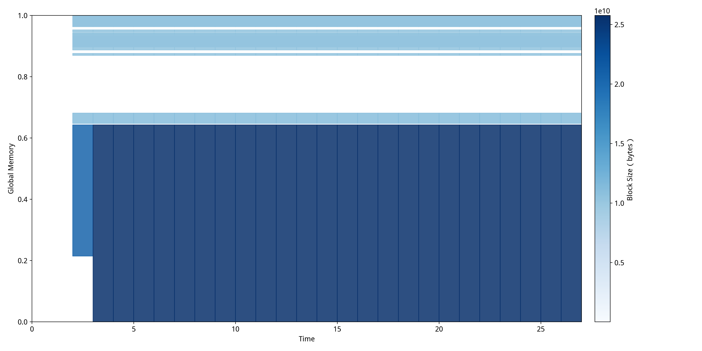
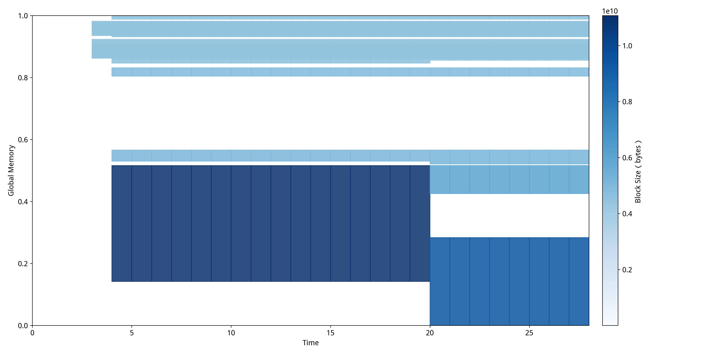
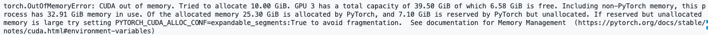
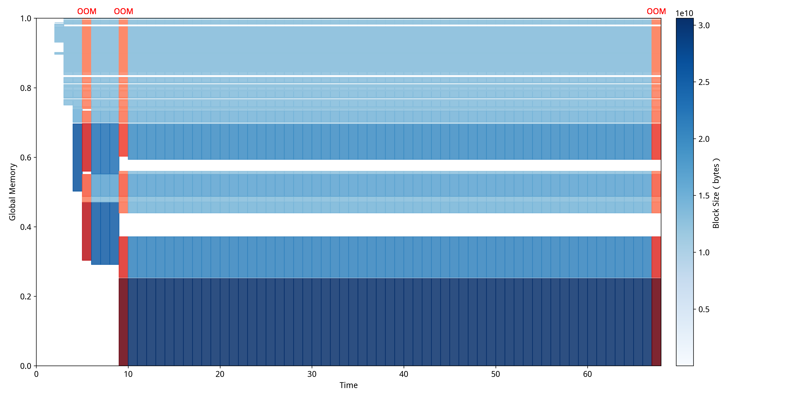
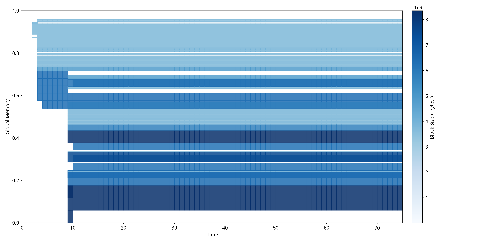

# GPU异常检测案例研究

## 传统注意力 vs FlashAttention

我们选取了使用传统注意力机制和FlashAttention进行推理的两个样例进行测试。传统注意力机制和FlashAttention都是Transformer模型中的核心组件，用于计算序列中不同位置之间的关联性。传统注意力机制采用标准的矩阵乘法实现，即先计算查询(Query)和键(Key)的乘积得到注意力分数矩阵，再与值(Value)相乘得到输出，这种方法在处理长序列时会产生巨大的中间矩阵，占用大量GPU显存。FlashAttention的核心优化在于重新设计了注意力计算的内存访问模式，通过分块(tiling)技术将大矩阵分解成小块进行计算，并利用GPU的高速片上内存(SRAM)而非慢速的高带宽内存(HBM)来存储中间结果，同时采用在线softmax算法避免存储完整的注意力矩阵。

传统注意力机制的MDTP:

FlashAttention的MDTP:

通过对比这两张MDTP，可以清楚地看到传统注意力机制和FlashAttention在内存使用模式上的根本性差异：

传统注意力机制中呈现出"层次化稳定模式"，显存使用率在整个推理过程中保持相对稳定，主要原因是传统注意力需要在前向传播开始时就分配完整的注意力矩阵空间，这些大块内存区域会持续占用显存直到计算完成。图中可以看到几个明显的水平带状区域，这些区域在时间轴上保持连续且稳定，反映了传统注意力"一次性分配大块内存"的特点，虽然内存使用效率不高，但分配模式相对简单规整。

FlashAttention中则展现出截然不同的"动态分块模式"，内存分配呈现明显的阶段性和波动性特征。在推理的前半段可以观察到密集的深蓝色区域，这对应FlashAttention的分块计算阶段，可以发现块的大小明显小于使用传统注意力机制时分配的块大小，这正是FlashAttention通过分块技术实现的优化效果，可以用更少的显存占用完成同样的任务。推理后半段出现的浅色区域和空白区域表明内存被高效释放和重用，这正是FlashAttention通过SRAM缓存和及时释放HBM内存实现的优化效果，证明了其在长序列处理中的显存优势和更灵活的内存管理策略。

## 碎片化导致的训练失败

我们选取了[基于PyTorch论坛真实案例](https://discuss.pytorch.org/t/unable-to-allocate-cuda-memory-when-there-is-enough-of-cached-memory/33296)构造的碎片化导致训练失败的实验进行测试。该案例源于一个典型的GPU显存分配失败问题，其中系统显示有足够的缓存内存但仍无法完成分配操作。由于原始论坛帖子未提供具体的复现代码，我们在Llama-8B模型微调训练框架中重现了这一异常场景。实验通过以下配置策略主动引入内存碎片化：将批处理大小设置为接近显存容量上限的数值以增加内存分配压力；禁用内存固定机制（dataloader_pin_memory=False），使数据加载过程无法利用页锁定内存的连续性保证，导致内存分配呈现随机化和非连续性特征；将数据加载工作进程数设置为零（dataloader_num_workers=0），强制系统采用单进程同步加载模式，避免了多进程环境下的内存预分配优化机制，使每次数据批次加载都需要进行临时的显存申请操作。通过这些配置的组合作用，成功复现了与原始论坛案例相似的OutOfMemory错误模式，如下图所示。

利用NeuTracer对该异常程序进行监测后得到 
从图中可以清晰地看出，在训练准备阶段就发生了OOM异常，在尝试了几次分配之后训练得以正常进行，然而在后续的训练过程需要分配更大的内存用于训练时发生了OOM异常，导致程序直接终止。可以发现此时存在一些内存空洞，导致无法分配连续的大块。

从图中可以清晰地观察到GPU显存的碎片化演进过程。在训练初始阶段（时间0-10），系统即出现多2次OOM异常，表现为图中红色标记的分配失败事件，此时内存块分布有碎片化的趋势。随着训练进程推进到中期阶段（时间10-60），虽然系统通过多次重试实现了部分内存分配的成功，但显存空间中仍存在大量间隙和空洞，这些碎片化区域在图中表现为蓝色内存块之间的白色空隙。当训练进入后期需要分配更大连续内存块用于梯度计算和参数更新时，由于无法找到足够大的连续空间，再次触发OOM异常并导致程序终止，这一过程在时间轴末端的红色区域得到清晰体现。

针对检测到的碎片化问题，我们实施了系统性的优化策略来验证修复效果。优化方案包括：重新启用内存固定机制（dataloader_pin_memory=True），确保数据在主机内存中以页锁定形式连续存储，减少主机到设备传输过程中的内存碎片产生；配置适当数量的数据加载工作进程（dataloader_num_workers=2），利用多进程并行加载的内存预分配特性，使内存分配模式更加规整和可预测；启用冗余列移除功能（remove_unused_columns=True），减少不必要的数据传输和内存占用，避免因冗余数据导致的额外内存碎片；启用批次尾部丢弃机制（dataloader_drop_last=True），确保所有训练批次具有一致的大小，消除因不完整批次造成的内存分配不均匀现象；通过环境变量PYTORCH_CUDA_ALLOC_CONF设置max_split_size_mb参数为3950MB，限制内存分配器的最大分块尺寸，防止过度细分导致的小块内存碎片累积。这些优化措施通过改善内存分配的时空局部性和连续性，显著提高了GPU显存的利用效率，使原本因碎片化导致失败的大块内存分配得以成功执行，训练过程恢复正常运行状态。针对修复后的程序，我们再一次运行NeuTracer，得到的MDTP如下图所示。

经过系统性优化策略修复后，从图中可以明显观察到显存使用模式的根本性改善。修复后的MDTP展现出截然不同的"紧凑型分布"特征：内存块在空间上呈现更加连续和规整的排列模式，深蓝色区域表示的大块连续内存分配明显增多，而碎片化导致的空白间隙显著减少。整个训练过程（时间0-70）中未出现任何红色OOM标记，表明内存分配策略的优化有效解决了碎片化问题。特别值得注意的是，修复后的内存分配呈现出明显的分层结构，不同大小的内存块能够有序排列，避免了碎片化现象的产生，使得训练程序能够稳定运行至完成。